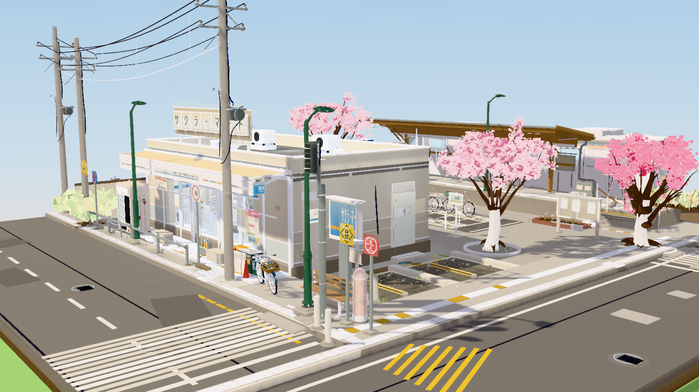

# AI Demo Collection

AI 辅助生成的交互式前端 Demo 合集。每个项目都是独立可运行的完整作品，后续会持续新增其他项目。

[](./LICENSE)

本仓库以 MIT License 开源，欢迎复用、改进和提交新的交互式 Demo。

## 开源说明

- 许可证：[MIT License](./LICENSE)
- 项目首页：[AI Demo Collection](https://fanhuayishiy.github.io/ai-demo)

## 项目预览地址

https://fanhuayishiy.github.io/ai-demo

## 项目列表

| 项目 | 简介 | 状态 |
| --- | --- | --- |
| [habitat-interactive-home](./habitat-interactive-home/) | 栖居 HABITAT 可探索家庭 3D 模型，支持多灯独立控制、家电交互与智能隐墙 | [在线预览](https://fanhuayishiy.github.io/ai-demo/habitat-interactive-home/dist/) |
| [hydrogen-energy-system](./hydrogen-energy-system/) | H₂ NEXUS 含氢综合能源数字孪生，五类能流动态可视化与守恒仿真 | 可交互 |
| [campus-3d-dashboard](./campus-3d-dashboard/) | 智慧校园 3D 数据大屏（单 HTML 文件） | 可运行 |
| [mcb-2p-c16-blender-animation](./mcb-2p-c16-blender-animation/) | 双极空气开关 Blender 精细建模与工程动画（主提示：调研空气开关，作为参考，然后使用 Blender 精细建模，我的标准很高，都要有动画） | 可交互 |
| [voxel-construction-site](./voxel-construction-site/) | 体素微缩建筑工地沙盘「方寸之间」（Three.js r160 完全离线单 HTML） | 可运行 |
| [voxel-ramen-stall](./voxel-ramen-stall/) | 体素微缩深夜拉面摊沙盘「深夜拉面摊」（Three.js r160 完全离线单 HTML） | 可运行 |
| [sakura-station-corner](./sakura-station-corner/) | 樱花街角 · 电车与便利店微缩三维沙盘（Three.js r186，102 个独立资产模块，五档天气，画面无文字无浮层） | 可交互 |
| [sanfang-qixiang-atlas](./sanfang-qixiang-atlas/) | 三坊七巷 · 坊巷漫游：基于真实地图的 3D 古城导览，支持景点搜索、滚轮缩放、点击飞行与空中漫游 | [在线预览](https://fanhuayishiy.github.io/ai-demo/sanfang-qixiang-atlas/dist/) |
| [terra-728-tractor-blender-animation](./terra-728-tractor-blender-animation/) | 现代四驱拖拉机 Blender 精细建模与机械动画（主提示：去学习一下 blender 怎么用，先调研一下拖拉机作为参考，然后精细建模，我的标准很高，内外配饰都要有动画） | [在线预览](https://fanhuayishiy.github.io/ai-demo/terra-728-tractor-blender-animation/) |

---

## hydrogen-energy-system — H₂ NEXUS 综合能源数字孪生

### 主生成提示（原文）

> 制作一个高科技风格的 3D 含氢综合能源系统动态可视化网页：支持 360° 旋转观察，包括能源流动的各个环节，各个设备合理布局，点击各能源设备可查看实时运行参数；
> 包含的能量流有：电-热-冷-氢，天然气。要先考虑好能量转换关系，在什么设备中可以完成对应的能量转换。
> 管线具备能量流动动态粒子效果，配备可调节气象与负荷的实时数据控制面板；重点保证清晰的工业建模、发光流线动效、真实能量守恒逻辑、深色科技质感

基于 Three.js 的深色工业中控网页：程序化三维能源园区、五色动态管线与本地守恒仿真联动。所有设备模型、运行逻辑、字体及依赖均随静态页面提供，无运行时 CDN 或远程模型依赖。

### 功能亮点

**3D 场景与工业设备**

- 包含光伏阵列、风力发电机、PEM 电解槽、储氢罐、燃料电池、天然气调压站、燃气热电联产、空气源热泵、复合制冷机组及用能建筑。
- 程序化生成金属设备外壳、罐体、管路、光伏板、风机叶片、园区底座与工业标识。
- 支持 360° 拖拽旋转、滚轮缩放、平移、自动环绕、俯视及复位；设备模型、浮动标签和侧栏下拉框均可选取设备。
- 深蓝金属底色、五色能量编码、阴影与辉光后处理，配合工业数显字体呈现科技中控质感。

**多能转换与动态能流**

| 设备 / 环节 | 能量转换与模型约束 |
| --- | --- |
| 光伏 / 风电 | 气象条件决定发电功率，风机包含切入、额定与切出区间 |
| PEM 电解槽 | 电 → 氢，净低位热值效率 68%，其余计入散热 |
| 储氢罐 | 0–4,000 kWh 有界库存，随模拟时间积分，禁止超充和透支 |
| 燃料电池 | 氢 → 电 + 热，电效率 52%、回收热效率 32%、损耗 16% |
| 燃气热电联产 | 天然气 → 电 + 热，电效率 36%、回收热效率 46%、损耗 18% |
| 空气源热泵 | 电 + 环境热 → 供热，COP 随温度变化 |
| 吸收式 / 压缩式制冷 | 热 / 电驱动制冷，显式计算冷凝排热 |
| 双向电网 | 按园区供需差额购电或上网，维持电母线平衡 |

- 电、热、冷、氢与天然气分别用黄、橙、蓝、绿、紫色管线表示；粒子沿能流方向运动，零功率时停止，电网进出口切换时反向。
- 支持按载能体筛选管线，并查看能量拓扑、转换关系和同步刷新的设备运行参数。
- 显式计入设备损耗、环境吸热、用户侧移热和冷凝排热，分别校验各载能体与全站能量守恒。

**交互与实时控制**

- 调节太阳辐照度、风速、环境温度及电 / 热 / 冷负荷，支持晴朗、多云、夜间气象预设。
- 暂停 / 恢复以及 1× / 10× / 60× 仿真速度；暂停期间调节参数可重算稳态功率，储氢库存保持不变。
- 展示总发电功率、可再生能源占比、储氢状态、双向电网交换、能量平衡、趋势与运行记录，可导出 CSV。
- 适配桌面与移动端，支持键盘焦点、减少动态效果偏好，以及 WebGL 不可用时的说明和二维控制界面。

### 验证与模型边界

- TypeScript 严格检查、ESLint、静态构建及 5 项模型测试通过。
- 测试覆盖 540 组气象 / 负荷与库存组合、空满储氢、风机切出、制冷排热、24 小时连续调度和暂停重算。
- **所有数值为本地仿真数据，不是现场遥测。** 模型采用稳态功率分配与动态储氢，不模拟管网压降、气体状态方程、设备劣化或实际控制器，不用于工程设计。

### 技术栈

| 依赖 | 版本 | 用途 |
| --- | --- | --- |
| Three.js | 0.160.1 | 程序化建模、轨道相机、模型选取与辉光后处理 |
| TypeScript | 5.9.3 | 严格类型检查与独立能源仿真模型 |
| esbuild | 0.25.12 | 打包 JavaScript、CSS 与本地字体 |
| ESLint | 9.39.1 | 源码检查 |
| Rajdhani / IBM Plex Mono | 5.2.7 | 工业数显与技术标记字体 |

### 运行方式

- 在线演示：<https://fanhuayishiy.github.io/ai-demo/hydrogen-energy-system/>（已公开部署，持有链接即可访问）。

已提交静态构建产物，本地运行无需安装 Node.js。在仓库根目录执行：

```bash
python3 -m http.server 8123
# 打开 http://localhost:8123/hydrogen-energy-system/
```

开发与重新构建使用 Node.js 24：

```bash
cd hydrogen-energy-system
npm ci
npm run dev
# 开发地址：http://localhost:5173

npm run lint
npm run typecheck
npm test
npm run build
```

### 目录结构

```text
hydrogen-energy-system/
├── index.html             # 页面入口
├── favicon.svg            # 站点图标
├── assets/                # 已打包脚本、样式、本地字体及许可证
├── src/
│   ├── simulation.ts      # 能量转换、调度、库存与守恒检查
│   ├── scene.ts           # 工业模型、相机、管线与动态粒子
│   ├── devices.ts         # 设备说明与运行参数
│   ├── main.ts            # 仪表盘、控制面板、趋势与运行记录
│   ├── palette.ts         # 载能体颜色与视觉常量
│   └── style.css          # 深色界面与响应式布局
├── tests/
│   └── simulation.test.ts # 物理不变量和边界测试
├── package.json           # 依赖、开发、构建及检查命令
└── README.md              # 详细模型假设与操作说明
```

完整的能量平衡方程与操作说明见 [项目 README](./hydrogen-energy-system/README.md)。

---

## campus-3d-dashboard — 智慧校园 3D 数据大屏


主提示词：创建一个校园3D可视化场景的HTML文件，使用Three.js的ES Module导入方式。

要求：

1. 等距视角（OrthographicCamera，类似策略游戏视角），带OrbitControls可拖拽旋转缩放
2. 场景居中是一个标准运动场——蓝色圆角矩形跑道，内部是绿色足球场（Canvas纹理画白线）
3. 8栋不同尺寸的现代建筑分布在运动场周围，每栋有：
     \- 白色BoxGeometry主体 + 屋顶女儿墙 + 入口雨棚
     \- 四面均匀排布的蓝色玻璃窗户（PlaneGeometry）
     \- 底层装饰带
4. 不同高度和半径的树木散布在场景中（分层锥体树冠 + 圆柱树干）
5. 浅色路径连接各建筑
6. 渐变草皮贴片点缀地面增加自然感
7. 使用DirectionalLight+AmbientLight+HemisphereLight实现自然光照
8. 开启阴影（PCFSoftShadowMap）+ ACES色调映射


基于 Three.js 的单文件 3D 交互大屏：等距视角校园场景 + Chart.js 数据看板叠加，支持昼夜切换、双相机切换、悬停提示，以及持续运转的车辆、喷泉等动态元素。

### 功能亮点

**3D 场景**

- 等距视角（OrthographicCamera，类策略游戏俯瞰），OrbitControls 可拖拽旋转缩放
- 场景中心是标准运动场：蓝色圆角矩形跑道（ShapeGeometry 挖洞）+ 绿色足球场（Canvas 纹理画白线）
- 8 栋不同尺寸的现代建筑：白色 BoxGeometry 主体 + 屋顶女儿墙 + 入口雨棚 + 四面蓝色玻璃窗（MeshPhysicalMaterial clearcoat 0.4，窗户高度动态计算、上下留 10% 边距）+ 底层装饰带，建筑方向通用、底部严格对齐地面
- 分层锥体树冠 + 圆柱树干的树木分散在校园内部和道路四周，渐变草皮贴片放在树下
- 校园边界：围墙 + 大门 + 门卫亭；校园内环圆角马路 + 四条市政道路（深灰路面、白色虚线边线、黄色虚中心线）
- 外围 3 环排布约 60 栋低多边形城市建筑（近/中/远环高度递减），与校内白色建筑形成层次
- 浅色路径连接各建筑，长椅、旗杆 + 旗帜点缀场景
- 路灯沿马路两侧对称排布（灯头朝路面、不压路），操场四角设高杆投光灯

**动态元素**

- 12 辆汽车（车身 + 驾驶舱 + 保险杠 + 轮子 + 前大灯 SpotLight + 尾灯）沿四条道路对向循环行驶，速度各异，到达尽头循环回另一端
- 三层喷泉粒子系统（350 粒子，PointsMaterial + AdditiveBlending，Canvas 径向渐变柔光贴图）：中心高速水柱 / 中速水帘 / 外层散开，重力下落、落水重置

**昼夜系统**

- 一键切换白天/夜景：夜景背景与雾色 #162030，ambient 0.24、sun 0.55、toneMappingExposure 0.85
- 夜景下建筑窗户 emissive 变暖黄 #ffcc77，路灯与车灯 SpotLight 全部点亮、灯泡 emissiveIntensity 提到 2.2，白天自动关闭

**交互与 UI**

- Raycaster 悬停建筑显示跟随鼠标的半透明 tooltip（userData 存名称，transition 过渡动画，pointer 光标）
- 右上角按钮：切换透视/正交相机（PerspectiveCamera 40° FOV，切换时保持视角位置与 controls.target 不变）、切换夜景/白天
- Chart.js 数据看板叠加层：顶部毛玻璃导航栏（标题 + 在校人数 12860 / 教职工 1240 / 建筑面积 28.6 万㎡ 三个统计指标）
- 左侧三张图表面片（backdrop-filter blur、圆角 14px、可滚动）：月度校园活跃度折线图（3 条线、12 个月学期波动）、各学院人数柱状图（7 学院七彩圆角柱）、设施使用占比环形图（6 类设施）
- resize 同时更新正交与透视两种相机的投影矩阵

**渲染质量**

- DirectionalLight + AmbientLight + HemisphereLight 三光自然照明
- PCFSoftShadowMap 柔和阴影 + ACESFilmicToneMapping 色调映射
- SpotLight 数量控制在 40 个以内，粒子单 geometry 复用，稳定流畅

### 技术栈

| 依赖 | 版本 | 引入方式 |
| --- | --- | --- |
| Three.js | 0.160+ | ES Module（import map，jsDelivr CDN） |
| OrbitControls | 同上 | ES Module |
| Chart.js | 4.4 | UMD CDN |

零构建工具、零外部图片/模型资源，单 HTML 文件直接运行。

### 运行方式

- 在线演示：<https://fanhuayishiy.github.io/ai-demo/campus-3d-dashboard/>
- 本地运行：直接双击 `index.html` 在浏览器打开即可（需联网加载 CDN 依赖）。

也可以起一个本地静态服务器：

```bash
# 任选其一
python -m http.server 8123
npx serve .
```

然后访问 `http://127.0.0.1:8123`。

### 目录结构

```
campus-3d-dashboard/
├── index.html      # 完整大屏（HTML + CSS + JS 单文件）
└── index.html.bak  # 迭代过程的历史备份版本
```

---

## mcb-2p-c16-blender-animation — 双极空气开关 Blender 精细建模与工程动画

主生成提示：调研空气开关，作为参考，然后使用 Blender 精细建模，我的标准很高，都要有动画。

基于公开产品尺寸与灭弧原理的无品牌热磁式微型断路器（MCB）示意模型，使用 Blender 5.2.1 程序化精细建模，交付 22 秒、8 章节工程动画，以及可编辑 `.blend`、通用 `.glb`、1080P 成片和 2560 × 1440 渲染图。内部机构为原理性示意，不是 ABB 原厂 CAD、制造图纸或电气性能仿真。

### 功能亮点

**建模与结构**

- 分极外壳、真实中空壳体、端子开孔、细倒角、模具分缝、筋条与外壳标记
- 双极联动手柄、贯通连接轴、动静触点、共同脱扣轴、内部支架与销轴
- 铜线磁脱扣线圈、铁芯、撞针、扭簧与复位弹簧
- 10 片有间隙的灭弧栅、弧道与分段灭弧示意
- 双金属片形变、随触点变形的编织铜软连接
- 真实凹槽和螺纹的端子螺钉、中空接线框、独立升降夹板
- 35 mm 导轨、安装槽、可活动卡扣及背部释放窗口

场景共 441 个对象、328 个网格对象、72 个动画数据块。模型以米存储，界面使用毫米单位；整体名义外形约为 35 × 88 × 69 mm，少量凸起印字不计入名义尺寸。

**动画章节**

时间轴为 1–528 帧、24 fps，完整片长 22 秒：

| 帧段 | 内容 |
| --- | --- |
| 1–72 | 整机旋转展示 |
| 73–143 | 联动手柄及快速分合闸 |
| 144–192 | 外壳剖视、内部机构展示 |
| 193–238 | 磁脱扣、触点分离、弧道与灭弧栅示意 |
| 239–287 | 双金属片形变与热脱扣示意 |
| 288–384 | 分层爆炸、螺钉松脱与回装 |
| 385–464 | DIN 导轨进入、卡扣释放与锁定 |
| 465–528 | 最终装配展示 |

**验证与质量**

- 316 个产品网格全部流形、无非法坐标，关键网格与体积检查通过
- 触点先于手柄到位：92 < 100、204 < 218、269 < 281
- GLB 包含组合时间轴与 17 个形变动画节点，校验零问题
- MP4 为 1920 × 1080 H264，528 帧解码回读比对 MAE < 0.71、PSNR > 46 dB
- 三张 2560 × 1440 Cycles 渲染图覆盖外观、剖面和爆炸视角

### 技术栈

| 依赖 | 版本 | 用途 |
| --- | --- | --- |
| Blender | 5.2.1 LTS | 程序化建模、动画、渲染、视频编码 |
| Python | Blender 内置 | 生成与验证脚本 |
| glTF 2.0 | 导出格式 | 通用 `.glb` 交付 |

### 运行方式

- 在线观看：<https://fanhuayishiy.github.io/ai-demo/mcb-2p-c16-blender-animation/MCB_2P_Engineering_Animation.mp4>
- 动画成片：直接播放 `MCB_2P_Engineering_Animation.mp4`
- 交互展示：打开 `index.html`（Three.js 直接加载 `MCB_2P_C16_Animated.glb`，支持 8 章节跳转、拖拽进度与旋转查看）
- 可编辑场景：用 Blender 5.2.1 或更新版本打开 `MCB_2P_C16_Animated.blend`，在时间轴播放
- 通用模型：`MCB_2P_C16_Animated.glb` 可拖入支持 glTF 的查看器或引擎
- 静帧展示：查看 `01_Hero.png`、`02_Cutaway.png`、`03_Exploded.png`

### 目录结构

```
mcb-2p-c16-blender-animation/
├── index.html                  # Three.js 交互查看器（加载同目录 GLB）
├── 00_Exterior_Preview.png       # 外观预览
├── 01_Hero.png                   # 主视觉
├── 02_Cutaway.png                # 剖视图
├── 03_Exploded.png               # 爆炸图
├── MCB_2P_C16_Animated.blend     # 主场景与动画
├── MCB_2P_C16_Animated.glb       # 通用模型
├── MCB_2P_Engineering_Animation.mp4
├── README.md                     # 项目详细说明与参考限制
└── Validation_Summary.json       # 校验摘要
```
---


## voxel-construction-site — 体素微缩建筑工地沙盘「方寸之间」

主生成提示：用 WebGL (Three.js r160 CDN) 创作一个体素微缩建筑工地沙盘场景，输出为可直接在 Chrome 打开的单个 HTML 文件，不引用任何外部资源，全部几何体、材质、贴图使用代码生成，目标稳定 60FPS，杜绝物体穿模。 场景载体：整套工地微缩模型摆放在室内深色实木工作桌面上，桌面边角散落蓝图图纸、钢卷尺、安全帽摆件、金属水平仪，第三人平视人眼高度视角观察整个沙盘。 工地主体布局：完整施工工地，划分基坑开挖区、钢筋加工棚、物料堆放区、在建高层楼房基座、临时板房办公区、渣土堆放区、临时施工道路。 动态机械设备：多台体素挖掘机持续作业，铲斗往复挖掘基坑土方；轮式渣土卡车循环行驶，开到挖掘机旁接土，满载后驶往渣土堆卸料；多台塔式塔吊回转吊起重钢筋、混凝土料斗，来回吊运物料；混凝土搅拌罐车缓慢行驶，小型装载机平整地面。 人物与细节：大量体素工人各司其职，有的绑扎钢筋、有的搬运建材、有的指挥塔吊、有的操作小型工具、安保人员在出入口巡逻；工地设置围挡、警示彩旗、施工指示灯、临时照明灯、脚手架、堆叠钢筋、水泥堆、砂石料堆、施工围挡大门、临时水电杆、安全警示标识。 环境与昼夜系统：完整日夜循环，黎明、正午、黄昏、夜晚四套天色；夜晚工地探照灯、塔吊灯、板房窗户向外发出暖辉光；尘土粒子效果缓缓飘散。 交互系统：鼠标拖拽环视相机，闲置时自动缓慢环绕场景；鼠标滚轮缩放视角；鼠标点击桌面前方实体模拟控制旋钮开关：调节工地设备运行速度、开关昼夜循环、切换施工尘土强度；按下空格键触发模拟暴雨天气，雨滴粒子、地面湿滑反光，工地灯光亮度提升。 技术要求：大量物体使用 InstancedMesh 实例化批渲染提升性能；自定义 shader 实现尘土粒子、灯光光晕；所有运动物体做好碰撞约束，不发生穿插穿模；全部工地元素限定在沙盘桌面范围之内，不会超出场景边界。色彩丰富，体素方块颗粒质感明显，细节饱满。

摆放在深色实木工作桌上的体素微缩建筑工地沙盘：第三人平视视角观察整个施工过程，挖掘机挖土、渣土车接运卸料、塔吊吊运物料、搅拌车与装载机协同作业，工人各司其职，配合完整昼夜循环与暴雨天气，全部模型、纹理与粒子均由代码生成，Three.js r160 已内嵌，完全离线运行。

### 功能亮点

**场景与布局**

- 室内深色实木工作台场景：桌面边角散落蓝图、钢卷尺、安全帽摆件、金属水平仪，工地整体限定在沙盘范围内
- 完整施工分区：基坑开挖区、钢筋加工棚、物料堆放区、在建高层楼房基座、临时板房办公区、渣土堆放区、临时施工道路
- 围挡、警示彩旗、施工指示灯、临时照明灯、脚手架、堆叠钢筋、水泥堆、砂石料堆、围挡大门、水电杆与安全标识等工地细节

**动态机械设备**

- 两台体素挖掘机在基坑内持续往复挖掘，动臂、斗杆、铲斗与液压杆联动
- 轮式渣土卡车循环行驶：开到挖掘机旁接土、满载后驶往渣土堆卸料，另有混凝土搅拌罐车缓慢行驶
- 两台塔式起重机在独立安全高度与扇区作业，分别吊运钢筋与混凝土料斗；小型装载机平整地面
- 大量体素工人通过 InstancedMesh 批渲染，分别执行绑扎钢筋、搬运建材、指挥塔吊、操作工具、出入口巡逻等动作

**昼夜与天气系统**

- 完整日夜循环：黎明、正午、黄昏、夜晚四套天色，夜晚探照灯、塔吊灯、板房窗户发出暖辉光
- 空格键触发模拟暴雨：雨滴粒子、地面湿润反光（ShaderMaterial 水洼），工地照明亮度同步提升
- 自定义 shader 实现尘土粒子、光束光晕；按按钮切换扬尘强度

**交互与性能**

- 鼠标拖拽环视、滚轮缩放，闲置时相机自动缓慢环绕，右上角 ⌖ 重置视角
- 点击桌面前方三个实体控制旋钮（或底部按钮）：调节设备运行速度、开关昼夜循环、切换扬尘强度
- 车辆采用间隔车队与固定装卸窗口，塔吊按独立高度与扇区约束运行，240 秒采样 1201 次的碰撞审计脚本校验穿模
- InstancedMesh 实例化批渲染 + 自适应画质调节，UI 显示实时 FPS

### 技术栈

| 依赖 | 版本 | 用途 |
| --- | --- | --- |
| Three.js | r160 | WebGL 渲染（已内嵌，离线运行） |
| 自定义 ShaderMaterial | — | 尘土、雨滴、水洼反光、光束光晕 |
| Node.js | 内置模块 | `build.cjs` 打包单文件 HTML，审计脚本校验 |

### 运行方式

- 在线演示：<https://fanhuayishiy.github.io/ai-demo/voxel-construction-site/preview.html>
- 本地运行：直接双击 `preview.html` 在 Chrome 浏览器打开即可，无需联网、无需构建。

如需从源码重新打包单文件：

```bash
node build.cjs
```

### 目录结构


---

## voxel-ramen-stall — 体素微缩深夜拉面摊沙盘「深夜拉面摊」

主生成提示：WebGL（Three.js r160，开发期可用 CDN，最终内嵌为单文件、断网可运行）创作一个体素微缩深夜拉面摊沙盘场景，输出为可直接在 Chrome 打开的单个 HTML 文件，不引用任何外部资源，全部几何体、材质、贴图使用代码生成，目标稳定 60FPS，杜绝物体穿模与越界。 场景载体：整套微缩深夜拉面摊摆放在室内旧木推车台面上，推车台面边角散落竹筷筒、酱油瓶、搪瓷碗、白瓷汤勺，第三人平视人眼高度视角观察整个沙盘。 拉面摊主体布局：完整深夜拉面摊，划分汤锅与煮面区、备料切配台、食客长凳与条桌、洗碗池与潲水桶、招牌灯箱与蓝布暖帘入口、后巷杂物角、路边人行道。 动态机械与摊位运转：多台体素设备与摊主持续作业，送面外卖摩托沿固定路线循环行驶，从摊位前取餐出发、穿过后巷驶向街口、在路口掉头折返、回到摊前熄火等单、接到新单再出发，循环往复；煮面篓在汤锅上原地往复起落，抓面下锅、沉入沸水、提起沥水、抖散装碗；拉面师傅在案板前持续抻面，取面团、双手抻拉、抖开、对折再抻、下锅、捞起、装碗递出；挂灯笼的长竹竿绕摊位横杆缓慢回转吊运，起吊新灯笼、平移对位、挂上横杆、空钩荡回；食客与流浪猫自由漫游，食客从街口走入、在菜单牌前驻足、落座长凳、吸面喝汤、起身离场，流浪猫沿桌脚与后巷慢悠悠游走、停下嗅闻、跳上啤酒箱打盹；汤锅上方排风扇持续旋转，暖帘随夜风摆动。 人物与细节：大量体素食客与摊主各司其职，有的拉面师傅在案板前抻面下锅、有的帮工在备料台切叉烧切葱花、有的食客坐在长凳上吸面喝汤、有的站着等位张望、有的举着手机拍照、有的收摊洗碗擦桌、外卖骑手在摊前取餐装箱；夜宵摊设置红灯笼串、蓝布暖帘、木招牌灯箱、塑料菜单牌、折叠长凳与条桌、啤酒箱、调料罐与酱油瓶醋瓶辣油、纸巾盒、一次性筷筒、潲水桶、煤气罐与软管、街边消防栓、路灯杆与架空电线、地面水洼与墙角烟头。 环境与昼夜系统：完整日夜循环，黎明薄雾、正午强光、黄昏逆光、夜晚灯火通明四套天色，默认停在深夜状态；夜晚汤锅上方吊灯、招牌灯箱、红灯笼串、后巷路灯、外卖摩托前照灯与摊位四周串灯、后巷住户窗户、街口信号灯向外发出暖黄与暖红辉光，照亮条桌与蒸腾的汤锅；汤锅蒸汽粒子缓缓上升飘散；按下空格键触发模拟夜雨，雨丝粒子斜落、地面与长凳湿滑反光、水洼泛起涟漪、灯光在湿地面拖出长条倒影，摊位照明亮度提升。 交互系统：鼠标拖拽环视相机，闲置时自动缓慢环绕场景；鼠标滚轮缩放视角，移动端支持双指缩放；鼠标点击推车台面前方实体控制旋钮：调节摊位运转速度与甩面煮面节奏、开关昼夜循环、切换汤锅蒸汽强度；按下空格键触发模拟夜雨，雨丝粒子斜落、地面湿滑反光，摊位灯光亮度提升。 技术要求：大量物体使用 InstancedMesh 实例化批渲染提升性能；自定义 shader 实现汤锅蒸汽粒子、灯光光晕与夜雨；所有运动物体做好碰撞约束与活动范围约束，不发生穿插穿模；全部拉面摊元素限定在沙盘推车台面范围之内，不会超出场景边界；静态体素按材质合并批渲染，重复食客与颗粒物实例化；全部随机数使用固定种子，每次打开画面完全一致；模拟时间与真实帧率解耦，低帧率下动作不变形；画质随帧率自适应；色彩丰富，体素方块颗粒质感明显，细节饱满。完成后请自查：所有运动物体在全时段模拟中与静态物及其他运动物体均无相交，且无元素越出沙盘边界。

### 功能亮点

**场景与布局**

- 室内旧木推车场景：辐条木轮、车把、台面边角散落竹筷筒、酱油瓶、搪瓷碗、白瓷汤勺，整套沙盘限定在推车台面范围之内
- 完整摊位分区：汤锅与煮面区（煤气罐与软管、吊灯、排风罩与旋转排风扇）、备料切配台、食客长凳与条桌、洗碗池与潲水桶、蓝布暖帘入口、木招牌灯箱、红灯笼横杆、塑料菜单牌
- 街景细节：后巷杂物角（啤酒箱、垃圾袋、墙角烟头）、路边人行道、消防栓、路灯杆与架空电线、街口信号灯、斑马线、地面水洼、后巷居民楼亮灯窗户与楼顶水箱

**动态机械与摊位运转**

- 外卖摩托沿固定路线循环：摊前取餐出发、穿过后巷、街口掉头折返、回摊熄火等单；骑手会下车走到柜台取餐装箱再出发
- 煮面篓在汤锅上往复起落：抓面下锅、沉入沸水、提起沥水、抖散装碗，与师傅节奏同步
- 拉面师傅持续抻面：取面团、双手抻拉、抖开、对折再抻、甩面下锅，装好的汤面沿柜台滑向出餐口
- 挂灯笼的长竹竿吊臂绕桅顶回转：起吊新灯笼、平移对位、挂上横杆，挂满五盏后再逐个取下替换，空钩荡回
- 食客从街口走入、在菜单牌前驻足、落座长凳吸面喝汤、起身离场；帮工切叉烧切葱花、洗碗、擦桌、等位张望、举手机拍照各司其职
- 流浪猫沿桌脚与后巷慢悠悠游走、停下嗅闻、两段式跳上啤酒箱打盹、跳下继续巡逻

**昼夜与天气系统**

- 完整日夜循环：黎明薄雾、正午强光、黄昏逆光、夜晚灯火通明四套天色，默认定格深夜
- 夜晚汤锅吊灯、招牌灯箱、红灯笼串、后巷路灯、摩托前照灯与摊位四周串灯、住户窗户、街口信号灯同时点亮，照亮条桌与蒸腾的汤锅
- 空格键触发模拟夜雨：雨丝斜落、水洼泛起涟漪、灯光在湿地面拖出长条倒影，摊位照明亮度提升
- 自定义 shader 实现汤锅蒸汽粒子、灯光光晕、夜雨丝、水洼涟漪与湿地面光带；暖帘通过顶点着色器注入随风摆动

**交互与性能**

- 鼠标拖拽环视、滚轮缩放（移动端双指缩放），闲置时相机自动缓慢环绕，右上角 ⌖ 重置视角
- 点击推车台面前方三个实体控制旋钮（或底部按钮）：调节摊位运转速度与甩面煮面节奏、开关昼夜循环、切换汤锅蒸汽强度
- 全部运动物体为纯 f(t) 确定性动画，模拟时间与真实帧率解耦，低帧率下动作不变形；固定随机种子，每次打开画面完全一致
- 1921 个采样点覆盖 480 秒全周期的 OBB + SAT 碰撞审计：0 次穿模、0 次互撞、0 次越界（`audit-ramen.cjs` + `collision-report.json`）
- InstancedMesh 实例化批渲染（静态体素合并、人物零件与颗粒物实例化）+ 自适应画质调节，UI 显示实时 FPS

### 技术栈

| 依赖 | 版本 | 用途 |
| --- | --- | --- |
| Three.js | r160 | WebGL 渲染（已内嵌，离线运行） |
| 自定义 ShaderMaterial | — | 蒸汽粒子、雨丝、水洼涟漪、湿地面光带倒影、灯光光晕、暖帘摆动 |
| Node.js | 内置模块 | `build.cjs` 打包单文件 HTML，`audit-ramen.cjs` 全时段碰撞审计 |

### 运行方式

- 在线演示：<https://fanhuayishiy.github.io/ai-demo/voxel-ramen-stall/preview.html>
- 本地运行：直接双击 `preview.html` 在 Chrome 浏览器打开即可，无需联网、无需构建。

如需从源码重新打包单文件，或重新跑一次碰撞审计：

```bash
node build.cjs
node audit-ramen.cjs
```

### 目录结构

```
voxel-ramen-stall/
├── preview.html            # 最终单文件（HTML + CSS + JS，Three.js r160 内嵌）
├── shell.html              # 页面骨架（UI 覆盖层模板）
├── core.js                 # 渲染器、昼夜光照系统、体素批渲染基建
├── room.js                 # 室内木推车载体、台面边角道具、实体旋钮
├── street.js               # 静态沙盘：路面、摊位、后巷、街口、建筑
├── machines.js             # 动态实体：摩托/煮面篓/抻面师傅/吊臂/人物/猫
├── effects.js              # 蒸汽、夜雨、水洼、湿地面光带 shader
├── main.js                 # 相机、交互、UI、自适应画质、主循环与自查钩子
├── three-r160.min.js       # Three.js r160（UMD 内嵌源）
├── build.cjs               # 单文件打包脚本
├── audit-ramen.cjs         # 全时段 OBB 碰撞审计（1921 采样点）
├── collision-report.json   # 审计报告（零碰撞、零越界）
├── night-view.png          # 夜景全景
├── stall-closeup.png       # 摊位特写
├── rain-view.png           # 模拟夜雨
└── day-view.png            # 白天状态
```

---

## sakura-station-corner — 樱花街角 · 电车与便利店微缩三维沙盘

主生成提示：用 Three.js 制作白天晴暖氛围的日式乡村车站街角便利店微缩三维景观。第三人称自由观景视角，无 UI、无弹窗、无标注、无控件、无水印、无多余文字干扰；鼠标/触摸拖拽平移、360° 旋转、无极（连续对数）缩放，阻尼平滑；整个场景放在一块规整正方形纯色底座上（diorama 微缩模型质感）；安静治愈、春日樱花街头感、空间层次分明；场景内不放置人物与动物。质量优先，不计时间、token、渲染开销；禁止批量粗制合成，每个物件独立建模、不合并网格、不简化细节；所有道具带现实经年磨损与轻微破损；每个资产必须是独立文件，便利店内部物品同样逐件独立建模并独立成文件；禁止把全部模型逻辑塞进单个 HTML，地图与每一个模型资产全部拆分为独立模块文件导入组装。

白天晴暖的日式乡村车站街角：单线电车与站台、临街 24 小时便利店（整面落地玻璃，店内货架、冷藏柜、收银台、おでん、商品逐件可见）、带玻璃门的自动贩卖机、自行车置场、伞立与分类垃圾桶、电线杆之间的档间电线、三株樱花与持续落樱。默认低多边形平涂方向，`?style=toon` 可切回三渲二 + 反壳描边 + 景深/Bloom 后期，两种风格共用同一套几何与材质。



### 功能亮点

**模块化工程（硬性约束）**

- 102 个资产模块文件，一物一文件（植生 / 店铺 / 街道 / 自行车 / 车站 / 室内 / 商品 / 建筑），另有 14 个地图层模块、12 个引擎模块、7 个动效模块
- `import.meta.glob` 静态收集 + 落位总表异步装配；单个文件出错只让它自己缺席，并记入 `engine.missing` 供工具核对
- 全部纹理由 Canvas2D 程序化生成，仓库里没有一张外部图片，也没有任何 CDN 与运行时第三方依赖

**便利店与站内**

- 落地玻璃幕墙是 9 扇独立玻璃，反光只压在顶部 1/3 带上，店内从门口视角逐件可读
- 16 个室内模块 + 20 个商品模块：货架、壁面陈设、冷藏柜、便当柜、冷冻柜、收银台与 POS、おでん锅、照明、看板、段ボール堆；饮料/零食/饭团/报纸/杂志/牛奶纸盒逐件建模
- 自动贩卖机带真实玻璃门，每层饮料可见；配室外机、伞立、多个分类垃圾桶

**樱花与落樱**

- 染井吉野与晚樱八重两个物种独立建模：车削树干带板根与瘤节、三级分枝曲线走枝、花团按外亮内暗三色阶分布、单朵花带花梗与萼片
- 花瓣轮廓（基部收窄 → 中部最宽 → 先端樱花缺口 + 横向反卷）做进几何而不是贴图 alpha，因此平涂剥掉贴图后仍然是一朵朵花瓣而非粉白方块
- 空中 1500 片飘落翻滚、地面 5200 片堆积随风微动；落地高度查地图登记表（広場 0.009 / 駐輪場 0.016 / 歩道 0.15 / ホーム 0.72），飘出台座立即回收

**微缩模型感与经年细节**

- 纯色厚台座 + 窄草皮带，红线取景框外的铺面与物件全部裁掉（三道裁剪闸门 + 资产包围盒整件拒落地）
- 路面补修パッチ、窨井盖、缘石缺角、沥青裂缝、盲道磨损、招牌褪色与胶痕、自行车掉漆、侧沟泥沙、墙根青苔、投币口磨损逐件建模
- 电线只存在于相邻两杆之间，两端锚在碍子线留上；端杆被裁掉时该档电线一并消失，不会出现悬空线头

**画面近乎零 UI 的可测性**

- 画面不许出现调试信息，所以可观测性全部搬到无头工具里：`tools/` 25 个脚本覆盖包围盒核对、越框检测、真实拖拽帧率、逐资产消融、逐帧抖动分布、分辨率对照、材质/几何状态计数、LOD 阈值扫描、按形状反查杂物、启动墙钟的阶段归因、公网延迟复现、加载状态实拍、按键链路验天气切换、截图逐像素比对
- 画面里没有文字标注、水印与浮层；装配期有一条加载状态（1 px 细线 + 阶段名 + 百分比，进度取自真实上报的 10 个地图层 / 122 个资产 / 6 个动效系统），首帧画上屏幕后从 DOM 整块摘除。常驻的只有底部一条低对比度天气控件（0.42 透明度，指针靠近才实）
- 天气可切五档（晴 / 曇 / 雨 / 夕 / 夜）：底部控件点击，或 `1`–`5` 直选、`W` 循环、`?weather=` 定起始值，三条路共用同一个控制器。每档是一份完整状态（五盏灯、天空色阶、雾、曝光、后期分级、风、花瓣量、雨量），切换按指数收敛约 1.3 s 走完 95%，中途连按不打架；夜间亮度是逐件灯具给的（`lampGain` 3.1 作用在灯器自发光与其点光源上），不是整体提曝光。默认档与加天气系统之前的基线截图平均通道差 0.65/255
- 26553 个 Mesh 折叠为 6220 个实例批次（同几何 + 同材质 + 同渲染状态才合并，每件变换仍独立，几何永不 merge）
- 启动 8.5 s 出画面（本地 1600×900）、公网 8.8～9.4 s：慢的原因几乎全在贴图的生成与 GPU 上传，不在模型精度——
  平涂会剥掉的贴图不再画、印刷内容按屏上 texel 密度定尺寸、几何缓存键量化到 0.5 mm；装配期渲染限到
  ~8 fps（`?asm=`），到 `built` 从 7.9 s 压到 4.8 s，成帧时间方差从 ±0.9 s 收到 ±0.06 s；资产 chunk 改为
  启动即并发预热，公网实测从 35.95 s 降到 8.75 s（本地 7.9 s 时完全看不出那 27 s 是 100 次串行往返）
- LOD 带滞回（1.14 带宽）+ 阴影贴图按需刷新，消除「一闪一闪」的边界闪烁与周期性硬卡

### 技术栈

| 依赖 | 版本 | 用途 |
| --- | --- | --- |
| Three.js | r186 | WebGL2 渲染 |
| Vite | 7 | 开发服务器与构建（`base: './'`，产物可放任意子路径） |
| 自建 toon 内核 | — | 渐变台阶、阴影冷染、卡通高光、边缘光、风动、呼吸、流光 |
| Playwright | 1.63 | 无头 Chrome 实拍与指标采集（校验用，运行时零依赖） |

### 运行方式

- 在线演示：<https://fanhuayishiy.github.io/ai-demo/sakura-station-corner/dist/>（Pages 托管 `dist/`，无需构建，公网成帧中位 9.7 s、区间 9.4～10.2 s，按窗口大小；2026-09-20 修平涂剥贴图后内容贴图从 835 张涨到 1110 张，比原先记的 8.8～9.4 s 慢约 0.4 s）
- 本地开发：

```bash
cd sakura-station-corner
npm install
npm run dev          # http://127.0.0.1:5173
```

改源码后重新生成静态产物（合集里提交的是压缩版）：

```bash
npx vite build --minify
npm run check        # 逐个 import + build() 全部模块
npm run check:boot   # 无头启动：确认真正建完、加载层已摘除、进度报满且无 pageerror
node tools/shoot.mjs --views=hero,store,interior
```

### 目录结构

```
sakura-station-corner/
├── index.html                # 入口（只有 canvas 与一个 module script）
├── dist/                     # 构建产物（Pages 直接托管，故意提交）
├── src/main.js               # 引导：引擎 → 世界组装 → LOD → 动效
├── src/core/                 # 引擎层：调色板 / 程序化纹理 / toon 内核 / 材质库 / 几何积木
│                             #   风格开关 / LOD / 描边 / 后期 / 灯光 / 相机 / 渲染主循环
├── src/world/                # 地图层：底座·地表·路网·横断歩道·側溝·歩道·小巷·站台·轨道·踏切
│   ├── plan.js               # 场景总规划常量（与 docs/LAYOUT.md 一致）
│   └── placement.js          # 资产落位总表 + 取景框过滤
├── src/assets/<分类>/<名>.js  # 102 个资产模块，一物一文件
├── src/motion/               # 落樱、花枝微风、灯光呼吸、玻璃流光、信号渐变、空气光晕
├── tools/                    # 无头校验与实拍工具（20 个）
├── docs/                     # LAYOUT.md 布局 / CONTRACT.md 资产接口契约 / ASSET_CHECKLIST.md 分阶段记录
├── AGENT.md                  # 需求事实源与硬性约束
├── first-view.png            # 全貌
├── storefront.png            # 店前与落地玻璃
└── sakura-close.png          # 樱花与落樱近景
```

---

## habitat-interactive-home — 栖居 HABITAT 家庭 3D 空间

提示词：我希望写一个网页，是一个一个3d家庭模型，模型里类似 酷家乐  那种3维视图，展示主要软硬装家具家电，能够旋转拖动（自动隐藏遮挡视野的墙体）。其中的灯光家电是可以交互的，也就是点击开关灯，或者能够弹出交互菜单出来。
你开发一个独立的前端（根据情况也可以一并开发后端服务）项目，这里有户型图以及实拍图。 户型图和实拍图建立3维模型，要做到让每个电器实体都可以点击交互反馈有菜单，核心你要做可交互的家庭3d模型，我可以拖动旋转放大，点击户型里的具体某个电器，开关灯也会影响环境光线，注意一个房间可能有多个灯。
你要有高标准的审美，不能像酷家乐那样简约丑陋，优雅的交互效果 


一个以原创 108㎡ 示例户型为基础的家庭 3D 交互前端。用户可以环绕观察客厅、主卧、书房、餐厨、卫浴和阳台，点选模型中的灯具与家电，在右侧面板调整状态；灯光、色温和环境时段会实时影响三维空间的光影。

在线预览：<https://fanhuayishiy.github.io/ai-demo/habitat-interactive-home/dist/>

### 功能亮点

- Three.js 程序化构建家具、软装、墙体、门窗和 22 件设备，设备实体与设备列表使用稳定 ID 关联。
- 支持拖拽旋转、缩放、平移、俯视平面、房间聚焦和截图；自动隐墙会根据观察方向淡出遮挡视线的墙体。
- 客厅、主卧、书房和餐厨提供多路独立灯光；每盏灯可以单独开关、调节亮度和色温，并映射到实时点光源。
- 支持电视画面模式、空调、窗帘、冰箱、洗烘机、烤箱、油烟机、热水器、扫地机器人和音箱等家电交互。
- 提供舒适归家、沉浸观影、一夜好眠、安心离家四种场景；设置保存在浏览器本地存储中，移动端提供抽屉式设备面板。

### 技术栈

| 依赖 | 版本 | 用途 |
| --- | --- | --- |
| React | 19 | 页面状态、设备面板与响应式交互 |
| Three.js | 0.180 | 程序化家庭模型、灯光、相机和射线拾取 |
| TypeScript | 5.8 | 严格类型检查 |
| Vite | 6 | 开发服务器和生产构建 |

### 运行方式

```bash
cd habitat-interactive-home
npm ci
npm run dev
# 打开 http://localhost:5173

npm test
npm run build
```

### 目录结构

```text
habitat-interactive-home/
├── public/floorplan.svg       # 原创示例户型图
├── src/App.tsx                # 房间导航、控制面板与场景预设
├── src/scene/HomeScene.tsx    # Three.js 相机、光照、点选与智能隐墙
├── src/scene/house.ts         # 家庭空间与设备程序化模型
├── src/data.ts                # 房间、设备、场景和本地状态校验
├── src/styles.css             # 视觉系统与响应式布局
└── tests/home-state.test.ts   # 设备状态和持久化测试
```

户型与设备均为原创示例，不代表真实测绘，也不会连接真实家电；后续接入真实户型时，可替换 `src/scene/house.ts` 的空间几何并保留设备 ID 与控制层。

---

---

## sanfang-qixiang-atlas — 三坊七巷 · 坊巷漫游

在线预览：<https://fanhuayishiy.github.io/ai-demo/sanfang-qixiang-atlas/dist/>

### 主生成提示词（原文）

> 根据网上的地图，实现一个3D的三坊七巷旅游全景图，要求可以交互、滚轮缩放，点击某个地点后，可以自动飞过去。

基于 OpenStreetMap 真实街巷与建筑平面轮廓的交互式三维文化导览。场景以白墙黛瓦、马鞍墙、屋脊、窗棂、院落与榕树表现福州古城肌理，支持景点搜索和点击飞行；建筑高度、屋顶形式及装饰是风格化复原，不是摄影全景或测绘模型。

### 功能亮点

- 真实地图数据：901 个建筑、107 段道路、294 个庭院内孔、19 个导览地点。
- 左键拖拽旋转、右键拖拽平移、滚轮缩放；点击地图标签或左侧景点目录后相机平滑飞往地点。
- 景点搜索与筛选，3D / 俯瞰视角、朝北、恢复全景、标签显隐和日夜切换。
- 五站空中漫游，支持暂停、继续、手动下一站和结束；适配桌面、手机竖屏及低高度横屏。
- 页面显示 © OpenStreetMap contributors 和 ODbL 许可入口；近似坐标显示“位置示意”。

### 技术栈

| 依赖 | 用途 |
| --- | --- |
| Three.js 0.180.x | 3D 建模、轨道相机、阴影、材质和标签投影 |
| Vite 6.x | 本地开发、构建静态产物 |
| 原生 JavaScript / CSS | 交互状态、响应式导览界面 |

### 运行方式

Pages 托管已提交的 `dist/`，直接打开上方在线预览即可。重新构建：

```bash
cd sanfang-qixiang-atlas
npm ci
npm run build
npm run preview
```

本地静态验证也可以从仓库根目录运行 `python3 -m http.server 8123`，然后访问 `/sanfang-qixiang-atlas/dist/`。

### 目录结构

```text
sanfang-qixiang-atlas/
├── index.html              # 导览入口
├── src/main.js             # 界面、相机飞行、搜索、路线和标签
├── src/district.js         # OSM 轮廓、庭院、屋顶、道路和植被
├── src/style.css           # 响应式视觉系统
├── public/data/map.geojson # OSM 街巷与建筑数据
├── public/data/places.json # 景点、来源和坐标精度
├── public/data/prepare_map.py
├── public/sources.md       # 数据来源与许可
├── dist/                   # GitHub Pages 静态产物
└── README.md               # 项目说明
```

### 数据边界与验证

坐标使用 WGS84，原点为 `[119.2916, 26.085]`。小黄楼、二梅书屋和光禄吟台是公开地址对应街段的近似位置，不表示入口实测坐标；虚线路线是参观顺序，不是步行导航。已验证 `npm run build`、生产静态资源加载、桌面/竖屏/低高度横屏布局、滚轮缩放、拖拽旋转、搜索筛选、点击飞行、俯瞰日夜切换与漫游控制。

---

## terra-728-tractor-blender-animation — 现代四驱拖拉机 Blender 精细建模与机械动画

主生成提示：去学习一下blender怎么用，我下载好blender了，你配置好后，先调研一下拖拉机，作为参考，然后精细建模，我的标准很高，内外配饰都要有动画。

虚构命名的 TERRA 728 大型四驱 CVT 拖拉机概念模型，参考现代农机的公开机械架构，用 Blender 5.2.1 程序化建模，交付 1–360 帧、24 fps 的 15 秒六章节机械演示动画，以及可编辑 `.blend`、通用 `.glb`、四张 Cycles 渲染图和本地依赖的 Three.js 交互查看器。轴距、轮胎半径、开合角度与时序均为艺术调整，不是厂商 CAD、维修图纸或数字孪生。

### 功能亮点

**建模与结构**（1482 个对象、1363 个网格、228 217 个源顶点、25 种材质、35 个动画对象；名义外形约 6.08 × 2.84 × 3.89 m）

- 四只独立车轮：车削胎体、交错 V 形胎块、胎肩、侧壁环带、凸起字标、锻造轮辋凹槽、10 孔螺栓圈、中心盖与气门嘴；前后轮半径不同，同一地速下前轮转速更高
- 左右前轮绕真实主销竖轴转向，采用 Ackermann 近似，前翼子板随转向节一同偏转；传动轴、前后桥壳、转向节与拉杆齐备
- 多截面放样曲面机罩、腰部通风口、散热器格栅、锐角大灯、后视镜与多段支架；舱内是有体积与连接关系的发动机、冷却器薄片、独立液压驱动风扇、进气管路、滤筒、蓄电池与油箱
- 全景驾驶室按控制台层次建模：气动悬浮座椅带行程缓震、可折副驾驶座、橡胶风琴方向柱护套、中央横屏与右扶手屏、顶棚附加屏、液压拨杆、彩色按钮、三个踏板、车顶工作灯与两具旋转警示灯
- 后三点机构含两根下拉杆、两根提升连杆与摇臂；提升油缸与机罩气弹簧为真实伸缩副；后 PTO 花键轴、液压快接头、软管与反光警示板
- 全部部件按 `01 轮胎轮辋` 至 `06 后液压悬挂与 PTO` 分集合组织，枢轴独立，未合并成不可编辑的整体网格

**动画章节**（1–360 帧、24 fps、15 秒；整车在 120 帧停驻后转入机构审看）

| 帧 | 内容 |
| --- | --- |
| 001–120 | 四驱行驶与传动增速、油门与制动踏板踩放、座椅缓震起伏 |
| 080–122 | Ackermann 转向与方向盘联动 |
| 125–250 | 机罩抬至 43°、气弹簧伸展、冷却风扇持续旋转 27 圈 |
| 165–295 | 左侧车门开至 66°、副座翻折 |
| 245–345 | 后三点抬升 0.37 rad 与回落、油缸同步伸缩、PTO 输出 10 圈 |
| 282–344 | 双雨刷两个往复摆程、警示灯连续扫转 14 圈 |

**验证与质量**（95 项断言全部通过）

- 19 个受控子系统在采样帧上确实运动，其子部件相对父级矩阵误差 ≤ 3.6 × 10⁻⁷，花纹与把手不会脱离母体漂浮
- 四组伸缩副安装点误差 ≤ 3.8 × 10⁻⁵ m、轴向偏差 ≤ 1.3 × 10⁻⁷，活塞未脱开或凭空悬浮
- 机罩开启全程与风挡玻璃相交面对数为 0；七个采样帧顶点全部有限；最低点距地 0.3 mm
- GLB 头部与 chunk 长度自校验通过，1434 网格 / 1472 节点 / 34 动画片段，访问器无非有限数值
- 查看器在浏览器实测：五视点、六章节、帧拖拽、线框叠加与隐藏顶棚均可用

### 技术栈

| 依赖 | 版本 | 用途 |
| --- | --- | --- |
| Blender | 5.2.1 LTS | 程序化建模、动画、Cycles 渲染 |
| Python | Blender 内置 | 建模、校验与导出脚本 |
| glTF 2.0 | 导出格式 | 通用 `.glb` 交付 |
| Three.js | r186（随目录本地提供） | 浏览器交互查看器，不依赖 CDN |

### 运行方式

- 在线预览：<https://fanhuayishiy.github.io/ai-demo/terra-728-tractor-blender-animation/>
- 本地查看：在仓库根目录运行 `python -m http.server 8000`，打开 `http://localhost:8000/terra-728-tractor-blender-animation/`（GLB 与 ES Module 需经 HTTP 载入，直接双击打开 `index.html` 会被浏览器拦截）
- 可编辑场景：用 Blender 5.2.1 或更新版本打开 `TERRA_728.blend`，空格播放、小键盘 0 切相机
- 通用模型：`TERRA_728.glb` 可拖入任何支持 glTF 的查看器或引擎
- 静帧展示：`01_Hero.png`、`02_Rear_Three_Point.png`、`03_Engine_Bay.png`、`04_Cab_Interior.png`
- 复现构建：`blender -b --python scripts/build_tractor.py`，校验 `blender -b output/TERRA_728.blend --python scripts/verify_scene.py`

### 目录结构

```
terra-728-tractor-blender-animation/
├── index.html                  # Three.js 交互查看器（单文件，加载同目录 GLB）
├── TERRA_728.blend             # 主场景与动画
├── TERRA_728.glb               # 通用模型（29 MB）
├── 01_Hero.png                 # 整车前左 3/4
├── 02_Rear_Three_Point.png     # 后三点悬挂
├── 03_Engine_Bay.png           # 机罩开启的服务面
├── 04_Cab_Interior.png         # 驾驶室剖视（隐藏顶棚）
├── README.md                   # 项目详细说明、参考来源与边界
├── Validation_Summary.json     # 校验摘要与文件哈希
├── scripts/                    # 程序化建模、校验与资产导出脚本
└── vendor/                     # 本地 three.js r186 模块与许可证
```

### 数据边界与验证

比例参考 Fendt 700 Vario Gen7.1 官方产品页与技术参数表的 728 Vario 列，但轴距放大到 3.00 m、车顶含顶架 3.89 m，属艺术调整；轮胎仅按官方胎号估算无载理论外径。未获取正交蓝图或维修级装配图，隐藏结构、枢轴位置、配合间隙与管线路由均为概念设计。95 项断言与四张 Cycles 静帧是自动化检查，不替代人工逐帧视觉验收，也未与真机照片做过一致性比对。开合角度、速度与时序不得用于选型、制造、驾驶培训或安全认证。参考的官方图片版权归 AGCO / Fendt 所有，只作本地建模参考，未嵌入成品模型、界面或材质，本仓库不重新分发这些图片。

---

## 新增项目

后续新项目直接在根目录建独立文件夹，并在上方「项目列表」表格中补一行即可。建议每个项目自带 README 或在文件夹内说明运行方式。

---

友链：[LINUX DO 社区](https://linux.do/)。
