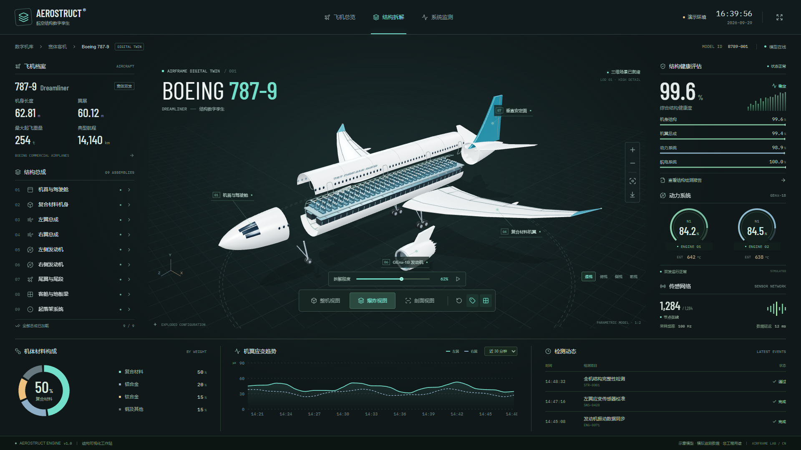

# AEROSTRUCT · 波音 787-9 结构数字孪生大屏

基于 React、Three.js 和 Recharts 的本地交互式航空工程可视化。首页直接呈现分层爆炸图，所有飞机部件均为真实三维几何，并非背景图片。

在线预览：<https://fanhuayishiy.github.io/ai-demo/boeing-787-digital-twin/dist/>



## 主生成提示（原文）

> 帮我做一个波音飞机的3D爆炸图和拆解图的大屏，旁边要有一些大屏图表和面板。用尽你的全部能力和资源，把它做到最好看、最精致、最吸引人

## 运行

```powershell
npm install
npm run dev
```

默认打开 http://localhost:5173。开发端口被占用时，Vite 会在终端显示实际端口。

```powershell
npm run build
npm run preview
```

仓库从 `main` 分支根目录发布 GitHub Pages，`dist/` 随源码一起提交。构建保留相对资源路径与第三方许可证，支持嵌套子目录部署。

## 功能

- 整机、爆炸和剖面模式，连续拆解进度及可暂停的往复演示。
- 起飞与降落动画：三维跑道、抬轮与拉平、起落架折叠收放、跟随镜头；支持暂停、拖动进度、重播和返回结构视图。速度与离地高度仅为概念动画读数，不是飞行性能仿真。
- 九大总成选择、三维点选、联动部件详情和局部高亮。
- 参数化机身、驾驶舱风挡、舷窗、翼型机翼、翼梢、尾翼、双发动机、风扇叶片、起落架，以及客舱座椅、地板梁和机身骨架。
- 鼠标或触摸旋转、缩放、四种镜头预设、自动旋转、部件标注和坐标网格。
- 材料构成、机翼应变、结构健康度、动力仪表、传感网络和检测记录。
- 全屏展示、PNG 视图导出及 JSON 检测报告导出。
- 手机、平板和桌面自适应布局；支持系统减少动态效果偏好。
- 独立部件近景、按总成方位自动构图，返回全机时保留拆解模式；鼠标悬停联动总成列表。
- 四块驾驶舱风挡、独立深色玻璃材质，以及发动机管线与紧固件、座椅扶手和起落架扭力臂细节。
- 标注自动避让；材料图例支持点击或键盘选择，并联动圆环中央读数。
- 紧凑且高度稳定的起降面板、自由飞行视角、机翼表面流线与翼尖尾流开关；起落架向内折叠并连续收入机腹。

## 验证

```powershell
npm test
npm run test:browser
npm run test:details
node tests/flight-browser.mjs
node tests/pages.mjs
```

浏览器测试需要本地开发服务运行于 5173 端口，并使用已安装的 Chrome。测试包含真实 WebGL 画布像素检查、三种模式、暂停保持、镜头、部件详情、报告和图片下载，以及多尺寸的布局边界检查。截图与检测结果保存在 `test-results/`。

`test:details` 额外检查九大总成的近景构图、像素可见性、返回全机状态，以及 1920、1366 和 390px 下的部件面板布局。

## 文件

`src/scene/aircraft.js` 创建飞机，`geometry.js` 定义连续机身截面和翼型。`Scene.jsx` 负责灯光、相机、动画、点选与释放资源。`state.js` 管理模式及交互状态，`data.js` 保存可替换的示意数据，`App.jsx` 与 `components/Charts.jsx` 组成大屏。

字体、依赖和三维模型均随项目在本地提供；运行时不依赖外部图片或模型 CDN，也不调用第三方数据接口。

## 使用边界

这是独立制作的概念展示项目，不是波音官方软件。飞机外形以 787-9 为视觉参考，三维结构为参数化示意模型，不是厂商 CAD、维修手册或精确零部件图。健康度、质量、应力、温度、传感器及检测事件均为明确标注的模拟数据，不连接真实飞机，不得用于维护、适航或工程决策。

驾驶舱采用 787 的四窗外观布局（两块前风挡、两块侧窗），参考 [Boeing 787 Dreamliner 外形说明](https://en.wikipedia.org/wiki/Boeing_787_Dreamliner)。玻璃轮廓及尺寸仍为程序化近似，不代表原厂风挡零件设计。

## 开源许可

项目遵循仓库根目录的 [MIT License](../LICENSE)。依赖许可证见 [dist/THIRD-PARTY-LICENSES.md](./dist/THIRD-PARTY-LICENSES.md)，字体许可保留在 `public/licenses/` 并随构建发布。机型名称仅用于说明视觉参考，不代表官方授权或关联。
