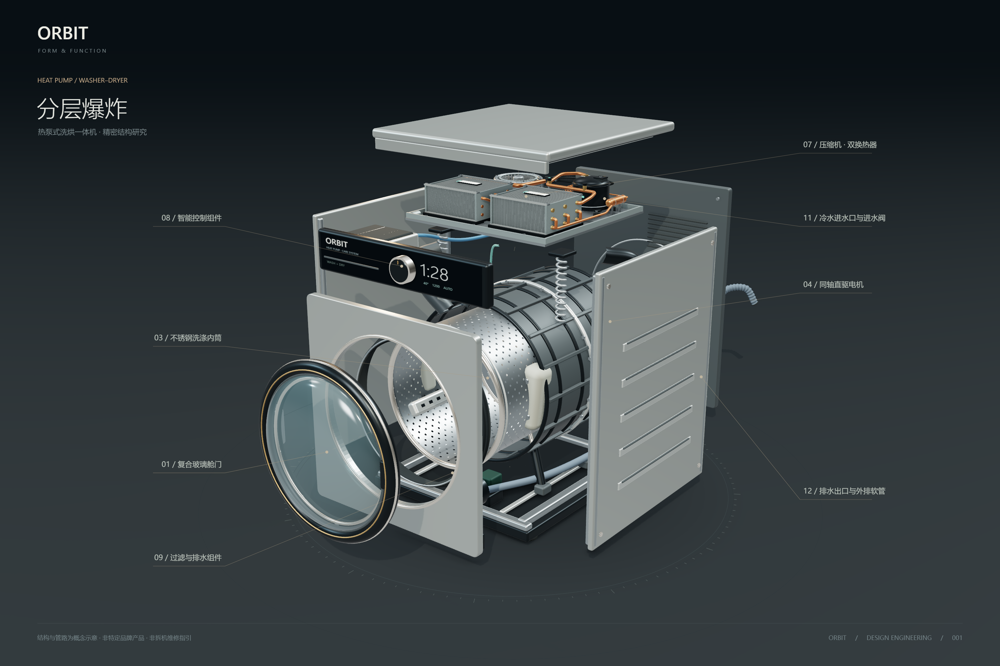

# ORBIT · 热泵洗烘结构实验室

可自由旋转的原创热泵式洗烘一体机概念模型，包含连续爆炸动画、去壳剖视、热循环示意和可选择的部件说明。所有几何、标贴与表面细节均在本地生成，不依赖远程图片或字体。

在线预览：<https://fanhuayishiy.github.io/ai-demo/orbit-heatpump-washer-dryer/dist/>



## 主生成提示（原文）

> 不要调用skill 帮我做一个热泵式洗烘一体洗衣机的3D爆炸图和拆解图。用尽你的全部能力和资源，把它做到最好看、最精致、最吸引人

## 功能亮点

- 四种可交互视图：整机、分层爆炸、内部拆解、热泵循环，支持连续拆解滑块与自动演示。
- 19 个装配组、13 类中文部件说明，点击选择、双击聚焦、自由旋转与缩放。
- 侧板平行移出，电机与内外筒沿同一中心轴分离；进排水接口和三段软管保持连接关系。
- 五张 3000 × 2000 PNG、含 13 秒拆装动画的 GLB，以及桌面和手机交互界面。
- 纯静态运行，无后端、API 密钥、运行时 CDN 或外部模型下载。

## 技术栈

- Three.js 0.180：程序化几何、PBR 材质、轨道相机、拾取、后处理和 glTF 导出。
- JavaScript ES Modules + 原生 HTML/CSS：界面交互、状态管理和响应式布局。
- Vite 7：开发服务与静态构建；精确依赖版本见 `package-lock.json`。
- Node.js 内置测试 + Playwright：几何、状态、浏览器交互与发布路径检查。

## 直接看成品

- [分层爆炸图](./output/01-爆炸图.png) — 3000 × 2000。
- [内部拆解图](./output/02-内部拆解图.png) — 3000 × 2000。
- [整机外观](./output/03-整机外观.png) — 3000 × 2000。
- [热泵循环](./output/04-热泵循环.png) — 3000 × 2000。
- [背面进排水接口](./output/05-背面进排水接口.png) — 3000 × 2000。
- [GLB 2.0 模型](./output/ORBIT-heatpump-animated.glb) — 含 13 秒展开、停留、复原动画，可导入 Blender 或兼容 glTF 的三维软件。

## 运行交互版

需要 Node.js 22.12+。首次运行：

```powershell
npm ci
npm run dev
```

打开终端显示的本地地址（通常为 http://127.0.0.1:5173/）。不要直接双击 `index.html`；浏览器必须通过本地服务加载模块。

```powershell
npm run build
npm run preview
```

上面两条命令用于构建和预览正式版本。`dist/` 已随源码提交，供本仓库从 `main` 根目录发布 GitHub Pages；在线入口为 `orbit-heatpump-washer-dryer/dist/`。相对资源路径支持部署到任意子目录。修改源码后需重新构建并同步提交 `dist/`。

## 目录结构

```text
orbit-heatpump-washer-dryer/
├── index.html          # 开发入口
├── src/                # 模型、管路、热泵、交互、样式与导出
├── public/             # 原创图标与 Three.js 许可证
├── dist/               # 已构建的 GitHub Pages 在线版本
├── output/             # 五张 3K PNG、GLB 和交互截图
├── scripts/            # 浏览器回归、静态发布检查与再导出
├── tests/              # 状态与热泵几何单元测试
├── package-lock.json   # 可复现依赖版本
└── vite.config.js      # 相对子路径构建配置
```

## 交互

- 拖动旋转，滚轮或双指缩放；右键拖动可平移。
- 底部四种模式：整机 / 分解 / 剖面 / 热循环。
- 滑块连续调节拆解程度，点击部件或左侧索引查看结构说明。
- 双击部件或点击“近看这一部件”聚焦；Esc 或重置按钮返回。
- 右上角“自动拆解”演示由整机到展开状态的过程。
- 相机按钮保存 3K PNG。帮助窗口可下载 GLB 模型。
- 右上方“查看背面接口”转到机背；“冷水进水”“排水出口”显示对应中文说明。
- 快捷键：1–4 切换模式，L 标注，R 自动旋转，空格演示，Esc 返回。
- 尊重系统的减少动态效果设置。

## 模型内容

19 个可分离装配组，13 类结构说明；包括真实镂孔内筒、三翼提升筋、带加强筋的外筒、门封、复合玻璃舱门、铜绕组直驱电机、顶部弹簧、底部阻尼器、配重块、压缩机、双翅片换热器、铜制冷媒管、风机、风道、控制板，以及冷水螺纹接口、滤网、进水电磁阀、机内供排水管、排水出口与机外波纹软管。

热泵盒中重复翅片和紧固件使用实例化几何。渲染使用 PBR 材质、环境照明、柔和阴影、GTAO 环境遮蔽、色调映射与抗锯齿。

## 原理与边界

这是结构概念模型，不代表任何特定品牌或机型，不是尺寸准确的制造 CAD，也不是拆机或维修指导。机身比例、模块布置、部件间距和管路被视觉化简化；爆炸过程中左右侧板只沿横向平移、不旋转，直驱电机沿滚筒中心轴向后分离，内外筒保持同轴。可以旋转视角观察被外壳遮挡的部件，不再通过错位部件消除遮挡。

机背上部蓝色冷水接口经进水阀、洗涤剂盒接入外筒；机背下部出口连接排水泵和外部波纹软管。三段连接软管以形变动画保持展开时的端点连接，仅为结构关系示意，非真实可拉伸长度；GLB 同步保留这些形变动画。外部软管的抬升高度不代表安装规格。

- 空气循环：滚筒湿空气 → 蒸发器冷却除湿 → 冷凝器回热 → 风机/风道 → 滚筒。
- 冷媒循环：压缩机 → 冷凝器 → 节流件 → 蒸发器 → 压缩机。
- 空气与冷媒是两条独立回路；蓝色排水线单独表示冷凝水。
- 界面时间、温度和转速仅为概念显示内容，不构成产品性能参数。
- GLB 保留几何、材料和拆解动画；实时后处理、界面标注、程序化热流以及镂孔透明映射在不同查看器中可能有差异，以交互版和 PNG 渲染为视觉基准。

## 验证与再导出

```powershell
npm test
npm run build
node scripts/verify-pages.mjs
node scripts/verify.mjs
node scripts/verify.mjs --export
node scripts/verify-plumbing.mjs
node scripts/verify-model.mjs
```

浏览器检查需要可用的 Playwright Chromium。若没有浏览器，可运行 `npx playwright install chromium`，或通过 `CHROME_PATH` 指定本机 Chromium 路径。`verify-pages.mjs` 自行启动临时静态服务，检查嵌套发布路径、资源请求、进排水说明及 PNG/GLB 下载。其余 `verify*.mjs` 命令需先运行 `npm run dev`，默认使用 `http://127.0.0.1:5173/`，也可用环境变量 `ORBIT_URL` 指定开发服务地址；再导出和 GLB 导入检查需要开发服务，不能改用构建预览地址。

交互测试覆盖四种视图、滑块、部件选择、聚焦、旋转/标注、演示、帮助及手机布局；输出 `output/verification.json`。管路检查覆盖 0%、18%、62%、100% 展开状态下的侧板姿态、筒体同轴关系与软管端点连续性。

主要源码：`src/model.js`（机械模型）、`src/heatpump.js`（热泵盒）、`src/main.js`（渲染与交互）、`src/state.js`（视图与文案）、`src/export-model.js`（带动画 GLB）、`src/style.css`（界面）。

## 开源许可

项目遵循仓库根目录的 [MIT License](../LICENSE)。随静态产物分发的 Three.js 使用 MIT 许可证，原文保留在 [public/THREE-LICENSE.txt](./public/THREE-LICENSE.txt)，构建时同步到 `dist/`。模型、图标和纹理为程序化生成，未使用第三方品牌模型或产品照片。
