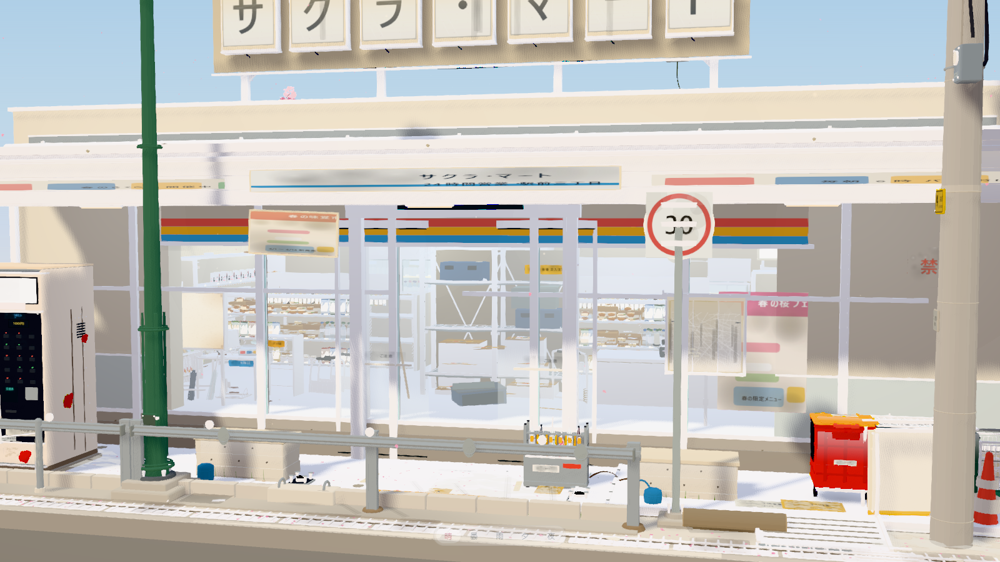
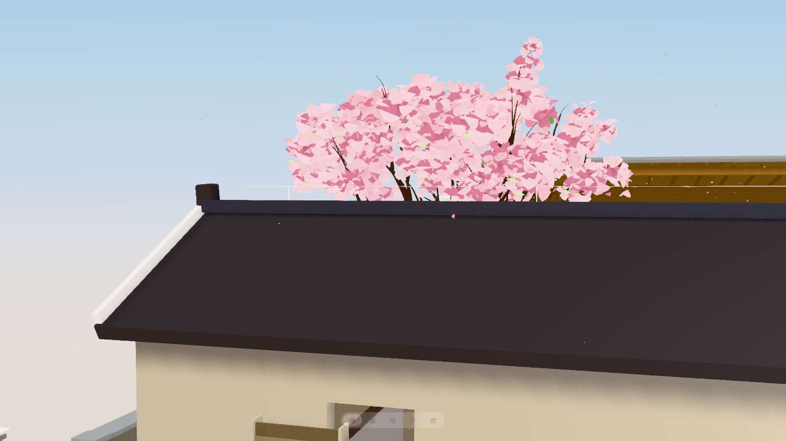
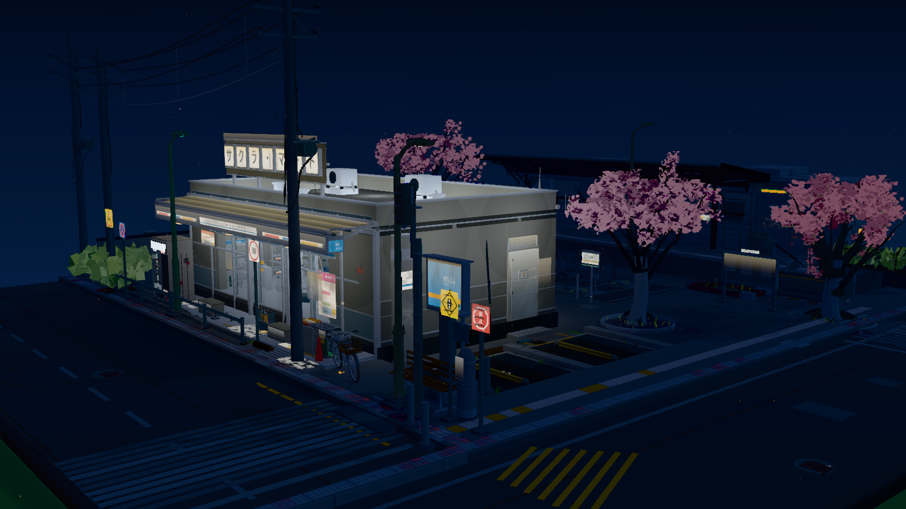

# 樱花街角 · 电车与便利店（微缩三维沙盘）

> 在线演示：<https://fanhuayishiy.github.io/ai-demo/sakura-station-corner/dist/>（公网出画面 8.8～9.4 s，按窗口大小；本地 8.5 s）

白天晴暖的**日式乡村车站街角**微缩沙盘：单线电车与站台、临街 24 小时便利店（整面落地玻璃，店内
货架 / 冷藏柜 / 收银台 / 商品全部可见）、自动贩卖机、自行车置场、电线杆与档间电线、三株樱花与持续落樱。
第三人称自由观景，成品画面零 UI（无文字、无控件、无水印、无标注）。

Three.js、字体与全部贴图都在仓库内：纹理由 Canvas2D 在运行时程序化生成，**没有任何一张外部图片，
也没有任何 CDN 或远程模型依赖**。默认是**低多边形平涂**方向（明亮色块、无描边、无后期）；
`?style=toon` 可切回原需求里的三渲二 + 反壳描边 + 景深/Bloom 后期，两种风格共用同一套几何与材质定义。






## 主生成提示（原文）

> 用 Three.js 制作**白天晴暖氛围的日式乡村车站街角便利店微缩三维景观**。
> 第三人称自由观景视角；无 UI、无弹窗、无标注、无控件、无水印、无多余文字干扰；
> 鼠标/触摸拖拽平移、360° 旋转、无极（连续对数）缩放；阻尼平滑。
> 整个场景放置在一块规整正方形纯色底座上（diorama 微缩模型质感）。
> 安静治愈，春日樱花街头感，空间层次与景深分明；场景内不放置人物、不放动物，保持静谧。
>
> **最高优先级原则**：质量优先，不计时间、token、渲染开销；禁止批量粗制合成；
> 每个物件独立建模、独立渲染，不合并网格、不简化细节、不压缩精度；
> 所有道具增加现实经年磨损、轻微破损细节（掉漆、锈斑、划痕、褪色贴纸、胶痕、凹陷、青苔、污渍流挂）；
> 每个资产必须是独立文件，便利店内部物品同样逐件独立建模并独立成文件。
>
> **工程硬性架构约束**：禁止把全部模型逻辑塞进单个 HTML；`index.html` 仅作为入口主框架；
> 地图与**每一个模型资产**全部拆分为独立模块文件，模块化导入组装。
>
> 追加要求（逐轮验收时提出）：两根电线杆之间有电线相连（电线的两头必须落在电线杆上）；
> 自动贩卖机要有真实玻璃门且每层都看得见饮料；有室外机、伞立、多个垃圾桶；
> 透过大玻璃能看见完整店内；只保留红线框内那一片，框外的连同框外地面物件一并去掉；
> 修掉一闪一闪的卡顿与乱动的广告；降体积降启动时间；落下来的换成粉色的樱花；
> 加载过程给出加载状态；增加一个天气切换。

完整需求与硬性约束见 [`AGENT.md`](./AGENT.md)，布局与坐标见 [`docs/LAYOUT.md`](./docs/LAYOUT.md)。

## 运行

在线演示直接点顶部链接（Pages 托管的是 `dist/`，无需构建）。

在仓库根目录起静态服务器也能直接看已提交的产物：

```bash
python3 -m http.server 8123
# 打开 http://localhost:8123/sakura-station-corner/dist/
```

开发需要 Node.js 24：

```bash
cd sakura-station-corner
npm install
npm run dev          # http://127.0.0.1:5173
npm run preview      # http://127.0.0.1:4173（预览已构建产物）
npm run build        # 产物 dist/（默认不压缩，约 4.9 MB）
```

校验（都跑无头页面，应用内浏览器会命中旧代码）：

```bash
npm run check        # 逐个 import + build() 全部模块，137/137
npm run check:boot   # 无头启动：确认真正建完（built）、加载层已摘除、无 pageerror
```

## 交互

- **左键拖拽 / 单指滑动**：360° 环绕；**滚轮 / 中键拖拽 / 双指推拉**：连续缩放，且缩放对准光标位置；
  **右键 / Shift + 左键 / 双指滑动**：平移。全部带阻尼（`dampingFactor 0.058`），松手后惯性收敛。
- 相机被限制在**不能钻进台座下方**：俯仰角 0.045–1.535 rad，视距 1.15–96 m，
  注视点限制在 x/z ±24 m、y −0.5～8.5 m 的盒子里，所以怎么拖都不会把沙盘翻到背面。
- 画面内**没有任何控件**：机位预设、风格、天气、耗时剖析都只走键盘或 URL 参数，不是界面上的按钮。
  `?style=toon` 切三渲二、`?weather=rain` 定起始天气、`?asm=full|slow|freeze` 调装配期渲染节流、
  `?trace=1` 打开耗时记录。
- 无音频、无自动巡游；场景内不放置人物与动物。昼夜与天气由人切换，不会自己流动。
- **天气可切换，但界面上没有按钮**：`1`–`5` 直选（晴 / 曇 / 雨 / 夕 / 夜）、`W` 顺序循环、`Shift+W` 反向；
  也可以走 URL 参数 `?weather=rain` 或 `__DIORAMA__.setWeather('night')`。
  每个天气是一份完整状态（五盏灯、天空色阶、雾、曝光、后期分级、风、花瓣量、雨量），
  切换时按指数收敛约 1.3 s 走完 95%，中途连按不会打架。默认 `clear` 与加天气系统之前的画面
  平均通道差 0.75/255，即默认外观不变。
- **加载状态**：装配期画面外有一层极简进度（标题 + 一条 1 px 细线 + 当前阶段与百分比），
  首帧真的画上屏幕后淡出并**从 DOM 里整块摘除**，所以成品画面依然是零 UI。
  进度是**真进度**而不是假动画：10 个地图层、122 个资产、6 个动效系统各自收尾时各报一次，
  写在 `engine.progress` 上（见 `src/core/boot-screen.js`）。

## 模型与边界

**这是一件按观感调出来的微缩模型，不是一处真实路口的复原，也不是按实尺放样的施工图。**

- 店名「サクラ・マート」、招牌文案、海报、商品包装与瓶身标签**全部自创**，不指向、不复制任何真实品牌。
- 物件尺寸是为构图与可读性调出来的：缘石高度、货架进深、花瓣大小都经过肉眼校准，
  没有一处来自图纸或实测数据；站台长度、电线杆间距同理，比例关系成立，绝对尺寸不作依据。
- 空间范围被一个红线矩形裁住（`docs/LAYOUT.md` 的 `CROP`）。框外的建筑、坡面、电塔连同其地面
  一并**不落位**，连端杆被裁掉的那档电线也一起删掉，所以画面边缘读起来是「切掉了」而不是「断在那儿」。
- 磨损、掉漆、青苔、泥沙、胶痕是逐件建模或逐件贴花，不是叠一层统一噪点；但它们是**视觉示意**，
  不代表材料劣化模型，也没有物理或寿命含义。
- 场景不模拟任何实时数据：没有交通流、没有客流。天气是**五套手调的完整状态**（晴 / 曇 / 雨 / 夕 / 夜），
  不是从某个大气模型算出来的；电车与信号灯的节奏也不随天气改变。

## 功能亮点

- **102 个资产模块文件**，一物一文件（`flora / store / street / bike / station / interior / products / buildings`），
  由 `import.meta.glob` 静态收集、按落位总表异步装配；单个文件损坏只让它自己缺席。
- **便利店不是贴图**：16 个室内模块（货架、壁面陈设、冷藏柜、便当柜、冷冻柜、收银台、おでん、
  照明、看板、段ボール…）+ 20 个商品模块（饮料、零食、饭团、报纸、杂志、牛奶纸盒…），
  落地玻璃是 9 扇独立可透的玻璃幕墙，店内从门口视角逐件可读。
- **电线只存在于两杆之间**：档距表 `SPANS` 的两端锚在碍子线留上，端杆被取景框裁掉时该档电线一并消失，
  绝不会出现悬空线头。
- **落樱是一朵朵樱花花瓣**：花瓣轮廓（基部收窄 → 中部最宽 → 先端樱花缺口 + 横向反卷）做进几何，
  不依赖贴图 alpha，因此平涂剥掉贴图后仍然不是「粉白方块」。空中 1500 片飘落翻滚、地面 5200 片堆积随风微动，
  落地高度查地图（広場 0.009 / 駐輪場 0.016 / 歩道 0.15 / ホーム 0.72），飘出台座立即回收。
- **零 UI 的代价是必须能测**：画面不许出现调试信息，所以所有可观测性都搬到无头工具里
  （`tools/` 25 个脚本：包围盒核对、越框检测、真实拖拽帧率、逐资产消融、逐帧抖动分布、
  分辨率对照、材质/几何状态计数、LOD 阈值扫描、按形状反查杂物、启动墙钟的阶段归因、
  加载状态实拍、按键链路验天气切换、截图逐像素比对、人为加公网往返延迟复现串行 chunk 拉取）。

## 技术栈

| 项 | 说明 |
| --- | --- |
| 渲染 | Three.js r186（WebGL2） |
| 构建 | Vite 7，`base: './'` 使产物可放在任意子路径 |
| 纹理 | 全部 Canvas2D 程序化生成（`src/core/textures.js`），无一张外部图片 |
| 着色 | 自建渐变台阶 toon 内核（`toon.js`）：色阶、阴影冷染、卡通高光、边缘光、风动、呼吸、流光 |
| 性能 | 实例化 + 实例合并、按投影尺寸分级隐藏（带滞回）、阴影贴图按需刷新 |
| 校验 | Playwright 无头 Chrome（本机 ANGLE/D3D11）实拍 + 指标采集 |
| 语言 | 原生 ES Module JavaScript，无框架、无运行时第三方依赖 |

## 源码

```
index.html                 入口框架：canvas + 加载层 + 一个 module script，无模型逻辑
src/main.js                引导：引擎 → 世界组装 → LOD → 动效（装配收在 async 函数里，见下）
src/core/                  13 个引擎模块
src/world/                 14 个地图层模块 + 落位总表
src/assets/<分类>/<名>.js   102 个资产模块，一物一文件
src/weather/                 5 个天气预设（clear/cloudy/rain/dusk/night）+ index.js 过渡 + sky.js 天空生成
src/motion/                8 个动效模块
tools/                     无头校验与实拍工具
docs/                      LAYOUT.md（分区/坐标/机位）、CONTRACT.md（资产接口契约）、ASSET_CHECKLIST.md（分阶段记录）
AGENT.md                   需求事实源与硬性约束
dist/                      构建产物（Pages 直接托管，故意提交）
```

`src/core/` 逐个职责：

- `engine.js` — 渲染器 / 场景 / 相机 / 主循环 / 装配进度分段权重（`BOOT_PHASES`）
- `boot-screen.js` — 加载状态：包住 `markProgress` 写 DOM，首帧后淡出摘除
- `kit.js` — 资产侧唯一工具箱：几何缓存、`grp/put/rotY`、`surface()` 铺面出口、实例折叠、取景裁剪
- `textures.js` — 全部 Canvas2D 程序化贴图与贴图字节账
- `materials.js` / `toon.js` / `palette.js` — 材质装配、自建 toon 着色内核、配色 token
- `style.js` — 风格总开关（`?style=`）、装配期渲染节流（`?asm=`）、耗时剖析出口（`?trace=`）
- `lighting.js` / `postfx.js` / `outline.js` — 日光与天空、后期链、描边壳
- `lod.js` / `camera-rig.js` — 按投影尺寸分级隐藏（带滞回）、轨道相机与限位

`src/world/`：`plan.js` 是场景总规划常量（与 `docs/LAYOUT.md` 一致），`placement.js` 是资产落位总表
兼取景框过滤，其余 12 个文件是底座·地表·路网·横断歩道·側溝·歩道·小巷·站台·轨道·踏切。

## 实现取舍（几处容易看错的地方）

- **「不合并网格」≠「不能实例化」**：几何数据永不改写、永不 merge；允许的是把「同几何 + 同材质 +
  同渲染状态」的零件折叠成一次提交（`InstancedMesh`），每件的位置/朝向/缩放仍逐件独立、造型差异照旧。
  真实货架本来就是同款重复摆放，所以这是更准确的建模而不是简化。全场景 26553 个 Mesh 折叠成 6220 个实例批次。
  另一条路（把静止零件 `mergeGeometries` 成 batch）做出来量过了：几何上传 −29%，启动反而慢 0.15 s，
  交互提升在噪声内，所以**撤回**（`docs/ASSET_CHECKLIST.md` 19.10）。
- **入口不能有顶层 `await`**：资产是分包的，带 TLA 的入口 chunk 会与共享代码形成异步循环，
  开发服务器逐文件加载看不出来，构建产物里 `import()` 直接永久挂起（既不报错也不 resolve）。
  所以装配收进 `boot()`，入口同步完成求值。
- **平涂会剥贴图**：`flatShading()` 删掉非 `graphic` 材质的 `map`，于是所有「靠 alpha 抠形」的面片
  都会退化成方块。花瓣、叶片、草むら的轮廓因此做进几何；内容贴图（海报、看板字、商品标签、屏幕）
  带 `graphic` 标记，不受影响。
- **地面标高是查出来的**：`surface()` 是所有铺面的唯一出口，它顺手登记矩形，`kit.groundYAt(x,z)`
  返回该点最高天面。任何要「躺在地面上」的东西都必须问它，否则一定不是埋进沥青就是悬在半空。
- **LOD 带滞回**：阈值在边界上会让小零件逐帧闪烁，因此进出用不同阈值（1.14 带宽），
  静止时阴影贴图才重绘（相机停 0.2 s 后、静置 3 s 再降到 1/5 频率）。

## 实测（无头 ANGLE + RTX 4060，1600×900）

| 指标 | 数值 |
| --- | --- |
| 启动到 `built` | 4.8 s（800×500）～8.2 s（1600×900）：装配本身 4.3 s，多出来的是装配窗口里插进来的节流帧（见下） |
| 启动到「看见成品」· 本地 | **8.5 s**（1600×900）：差额是 26.5k Mesh / 10.4k 几何 / 831 张贴图分批灌进 GPU 的时间——省不掉，只能从装配期挪到首帧，所以只看这个数才算优化 |
| 启动到「看见成品」· 公网 | **8.8 s**（GitHub Pages 800×500，实测；修复前 35.95 s；1600×900 为 9.44 s）。这里有个坑值得记：同一份产物本地 7.9 s、推上去 36 s，因为 `import.meta.glob` 把资产切成 ~100 个 lazy chunk 而装配循环逐个 `await`，公网就是 100 次串行往返；改成启动即并发预热后世界阶段 13.88 s → 5.44 s（`tools/net-lag.mjs` 给每个 chunk 加 120 ms 可在本地复现） |
| 场景规模 | 122 个资产实例 / 26553 Mesh / 6220 实例批次 / 10432 几何 / 3360 材质（49 个着色器 program） |
| JS 堆 | ≈ 240 MB（贴图位图 148 MB） |
| 交互 | 持续拖拽 draw calls ≈ 7000，4.8M 三角/帧，fps 中位 13.8（8.3 µs/次的 CPU 提交是瓶颈，不是填充率） |
| 产物 | `dist/` 4.9 MB / 104 个文件（主 chunk 2.57 MB，gzip 577 KB） |

## 验证范围与限制

已执行的检查：

- `npm run check`：137 个模块逐个 `import()` 并调用 `build()`，检查导出契约、几何有限性、包围盒非空。
- `npm run check:boot`：无头 Chrome 真启动，断言 `built`、加载层已从 DOM 摘除、零 `pageerror`、
  越界丢弃为 0，并打印实例 / Mesh / 几何 / 材质 / 贴图计数。
- `tools/shoot.mjs` 固定机位实拍 + `tools/peek.mjs` 自定义近摄：人工比对招牌与海报文字、玻璃后的店内层次。
- `tools/flicker.mjs`：逐帧读回同一块画面，量化相邻帧亮度差与方向翻转率（当前 max 0.06、翻转率 0）。
- `tools/perf.mjs`：派发连续 8 s 真实拖拽，测交互帧率与 draw calls（不是 `stats.fps` 那种静止态读数）。
- `tools/boot-time.mjs` / `tools/net-lag.mjs`：启动墙钟与公网延迟复现，取丢弃首轮后的中位数。
- `tools/weather-check.mjs`：往无头页面**按真键**逐档切天气，断言 `weather.current` 与
  日光强度 / 雾浓 / 曝光 / 雨丝实例数 / 花瓣实例数都真的跟着变了（用 `setWeather()` 验等于没验输入）。
- 默认天气与「加天气系统之前」的同机位基线截图做过逐像素比对：平均通道差 0.75/255、
  差值 >24 的像素 2.13%（那些是花瓣位置与灯呼吸相位，本来就在动），即默认外观未被这次改动带走。

已知不足：

- 店内视角对比度不够：内部材质明度层次太接近纯白，玻璃仍带轻微色味，「透过大玻璃看清店内」在店前
  机位读成一片白。要动的是室内曝光与材质明度分层，不是继续削 draw call。
- 绿篱、花坛、藤蔓一类仍用「卡片 + 贴图 alpha」做形，平涂下会读成方块；已把樱花系与店前铺面的
  贴花换成实形，其余还没换。
- 空中花瓣没有遮挡体概念，会从屋顶穿过去再落到地板上（密度低，肉眼不明显）。
- 交互帧率约 14 fps（1600×900）。瓶颈是 CPU 提交次数，进一步提速需要逐实例顶点着色器风动
  （让树冠也能跨小枝合并）或运动期临时提高 LOD 阈值。
- `?style=toon` 路径要生成平涂跳过的全部噪点贴图，启动约 2 分钟，只作风格对照，没有为它做过优化。
- 天气还差几件事：雨天地面不湿（要改的是上千个路面材质的粗糙度，属于「一次切换重写半个材质表」）；
  平涂模式没有 bloom，夜间的灯只亮不晕；雨没有水花与涟漪；电车与信号灯的节奏不随天气变。
- 以上指标全部来自本机单张 RTX 4060 + 无头 Chrome 的测量。低端移动设备、集显与高 DPI 屏未覆盖。
