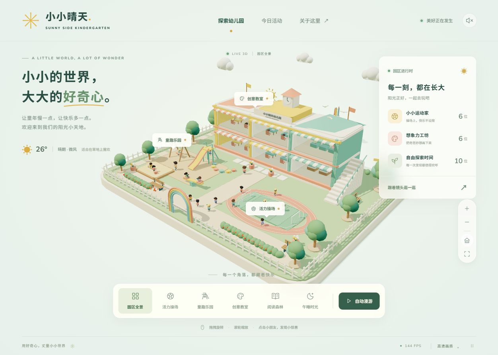

# 小小晴天 · Sunny Side Kindergarten

基于 Three.js / WebGL 的纯前端实时 3D 幼儿园。所有模型均由程序构建，不使用截图或预渲染视频。

[在线体验](https://fanhuayishiy.github.io/ai-demo/sunny-side-kindergarten/dist/) · [返回项目合集](../README.md) · [MIT License](../LICENSE)



## 主生成提示（原文）

```text
基于Three.js+WebGL开发可在现代浏览器直接运行的实时3D动态幼儿园网页Demo，为可交互实时渲染Web3D场景，非静态图与预渲染视频，整体采用高质量低多边形卡通微缩画风，造型圆润柔和、光照明亮自然、阴影柔和、材质干净清新，贴合儿童动画质感，无写实风格与廉价Demo质感，打造真实运转的迷你童趣幼儿园场景。场景包含2-3层带彩色装饰与中英文标识的幼儿园主楼，大面积玻璃窗可展示室内桌椅与课堂活动，户外搭建精致微缩园区，涵盖草坪、塑胶操场、环形跑道、小型足球场、滑梯、秋千、跷跷板、沙坑、花草树木、长椅、围栏与校门，整体布局紧凑，单视角可预览大部分园区。场景内置15至25名卡通儿童及2至4名卡通老师，全员配备待机、行走、奔跑、静坐、玩耍、挥手、交谈、跳跃等基础动画，人物动作时间错开、互不重复，随机实现荡秋千、滑滑梯、踢球、沙坑玩耍、追逐跑动、草坪闲聊、师生散步、室内学习、举手答题、绘画阅读等多样动态行为。场景搭载自然舒缓的全局环境动画，包含草木随风摆动、云朵缓慢平移、秋千跷跷板自主运动、风车旋转、足球微动、小鸟间歇飞过、室内人物小幅活动，动态细腻不杂乱。镜头默认采用四分之三俯视等距视角，支持鼠标拖拽旋转、滚轮缩放，可点击操场、游乐区、教室、阅读区、午休区实现镜头平滑过渡聚焦，新增自动漫游功能，可按全景、操场、游乐区、教室、阅读区的路径自动循环巡航。交互上支持人物悬停与点击展示户外活动、绘画阅读、体育活动等无隐私信息标签，点击单个小朋友可让镜头平滑拉近观察，支持返回全景。项目纯前端实现，兼容Chrome、Edge浏览器，支持屏幕自适应，通过轻量化建模、实例化渲染、LOD层级优化、合理阴影配置与RAF动画机制保障流畅帧率，自带加载动画与平滑入场效果，全程规避穿模、人物漂浮、动作同步僵硬、镜头穿墙等问题，优先完成高视觉质量MVP，重点优化场景质感、园区布局、人物动态、镜头交互、环境动画与性能适配，呈现阳光清新、全程动态鲜活的真实幼儿园微缩场景效果。
```

## 技术栈

- Three.js 0.180 / WebGL 实时渲染，原生 ES Module JavaScript。
- Vite 6 构建，相对资源路径适配 GitHub Pages 子目录。
- 原生 Node.js 测试；程序化几何、Canvas 文字纹理、Web Audio 合成鸟鸣。

## 启动

需要 Node.js 20.19+ 或 22+。

```sh
npm install
npm run dev
```

在本项目文件夹内执行以上命令，再打开终端显示的本地地址（通常为 http://localhost:5173/）。

```sh
npm test        # 人数、镜头目的地、连续路径、设施同步、座椅接地、LOD、绘画动作
npm run build  # 生成 dist 静态部署目录
npm run preview
```

`dist` 可部署到普通静态托管服务，使用相对资源路径。本仓库按现有 GitHub Pages 方式有意提交 `dist/`；源码更改后请重新构建并一并提交产物。请通过 HTTP 服务访问，而不是双击 HTML（浏览器会限制 ES 模块）。3D 场景无外部模型或图片依赖；字体有系统回退，无法加载 Google Fonts 时不影响功能。

## 探索

- 鼠标或触摸拖拽旋转；滚轮/双指缩放；右侧按钮放大、缩小、全景、全屏。
- 底部可进入全景、操场、游乐区、教室、阅读区、午休区。
- 人物悬停显示匿名活动标签；点击拉近并跟随人物；可随时返回全景。
- 自动漫游依次循环：全景 → 操场 → 游乐区 → 教室 → 阅读区。拖拽中断漫游。
- 页脚可切换高清/流畅画质与暂停/继续动画；右上角可开启合成鸟鸣（默认关闭）。

## 实现

22 名虚拟儿童、3 名虚拟老师。包括跑步、踢球、秋千、滑梯、跷跷板、沙坑、挥手、闲聊、跳跃、课堂、举手、阅读、绘画。使用错开的程序动画与安全预设路径，**不是导航网格、多智能体避障或完整随机行为 AI**。基础动作由可复用骨骼节点实现，不使用外部动画资产。

双层主楼以通透玻璃与开放立面展示室内，园区包含环形跑道、足球场、游乐设施、沙坑、围栏、彩虹门、花草、长椅、风车与云鸟动画。模型采用温暖低多边形材质。

性能策略：缓存材质/几何，703 个静态网格合并为 25 个实例批次，远距离隐藏人物 262 个细节网格，限制像素比，单盏阴影灯、2048 阴影贴图、流畅模式关闭阴影，RAF 动画，隐藏标签页暂停渲染。实际帧率取决于 GPU、窗口尺寸和浏览器；FPS 来自帧时间采样。

镜头限制在园区正面弧线内，避免进入主楼背墙。午休区展示布置好的空床位；人物行为为 MVP 演示，不宣称物理仿真或完全无碰撞。

## 文件结构

- `src/main.js`：渲染、灯光、镜头、拾取、UI、声音与生命周期。
- `src/campus.js`：建筑、园区、设施、实例化和环境动画。
- `src/people.js`：人物骨骼、行为路径、动作和 LOD。
- `src/navigation.js`：镜头位置与巡航顺序。
- `src/style.css` / `index.html`：中文响应式页面与交互控件。
- `tests/`：Node 原生测试，无额外测试运行器。

推荐开启硬件加速的最新版 Chrome / Edge。无法创建 WebGL 时会显示可操作的错误说明。

## 验证与开源许可

11 项自动测试及生产构建通过。桌面与手机视口检查、覆盖范围及未验证的边界见 [验证记录](./docs/verification.md)。本项目沿用仓库 [MIT License](../LICENSE)；Three.js 的 MIT 许可保留在 `public/THIRD-PARTY-LICENSES.txt`，构建时自动复制到 `dist/` 一同发布。
