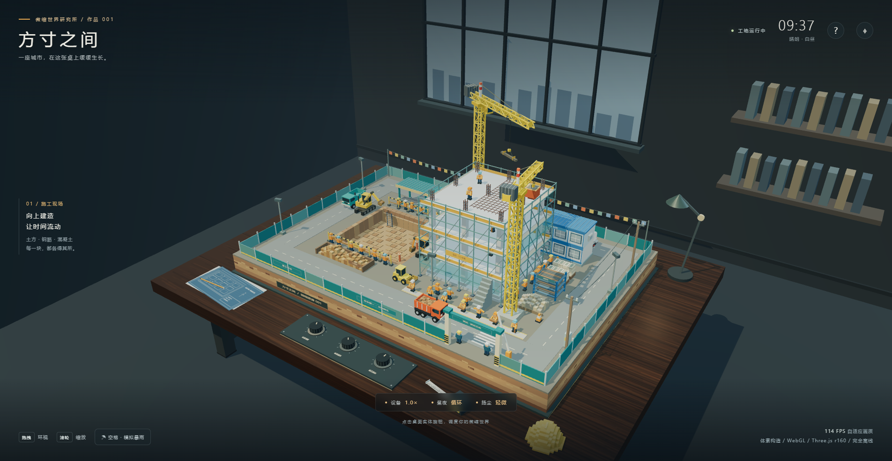
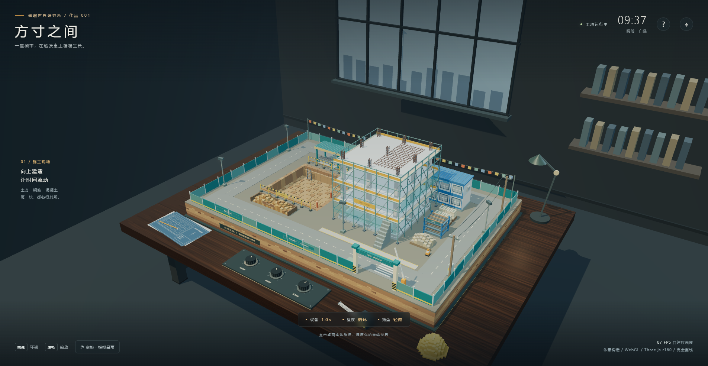
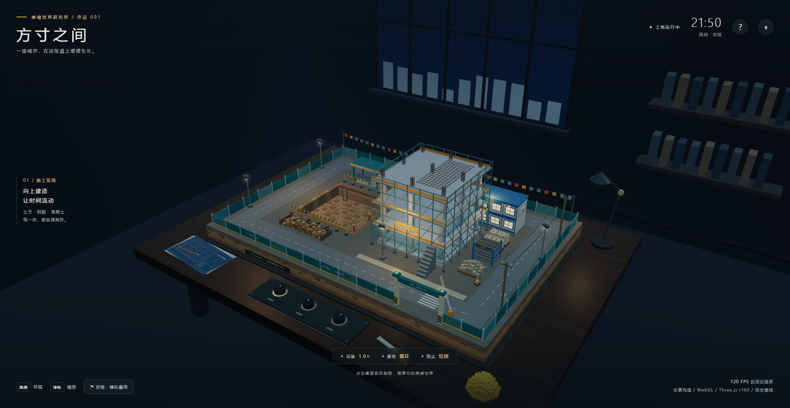
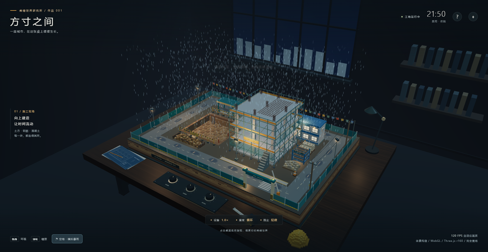

# 方寸之间 · 体素微缩建筑工地沙盘

摆放在深色实木工作桌上的体素微缩建筑工地沙盘：第三人平视视角观察整个施工过程，挖掘机挖土、渣土车接运卸料、塔吊吊运物料、搅拌车与装载机协同作业，工人各司其职，配合完整昼夜循环与暴雨天气。全部模型、纹理与粒子均由代码生成，Three.js r160 已内嵌，**完全离线运行**。

> 在线演示：<https://fanhuayishiy.github.io/ai-demo/voxel-construction-site/preview.html>






## 主生成提示（原文）

> 用 WebGL (Three.js r160 CDN) 创作一个体素微缩建筑工地沙盘场景，输出为可直接在 Chrome 打开的单个 HTML 文件，不引用任何外部资源，全部几何体、材质、贴图使用代码生成，目标稳定 60FPS，杜绝物体穿模。 场景载体：整套工地微缩模型摆放在室内深色实木工作桌面上，桌面边角散落蓝图图纸、钢卷尺、安全帽摆件、金属水平仪，第三人平视人眼高度视角观察整个沙盘。 工地主体布局：完整施工工地，划分基坑开挖区、钢筋加工棚、物料堆放区、在建高层楼房基座、临时板房办公区、渣土堆放区、临时施工道路。 动态机械设备：多台体素挖掘机持续作业，铲斗往复挖掘基坑土方；轮式渣土卡车循环行驶，开到挖掘机旁接土，满载后驶往渣土堆卸料；多台塔式塔吊回转吊起重钢筋、混凝土料斗，来回吊运物料；混凝土搅拌罐车缓慢行驶，小型装载机平整地面。 人物与细节：大量体素工人各司其职，有的绑扎钢筋、有的搬运建材、有的指挥塔吊、有的操作小型工具、安保人员在出入口巡逻；工地设置围挡、警示彩旗、施工指示灯、临时照明灯、脚手架、堆叠钢筋、水泥堆、砂石料堆、施工围挡大门、临时水电杆、安全警示标识。 环境与昼夜系统：完整日夜循环，黎明、正午、黄昏、夜晚四套天色；夜晚工地探照灯、塔吊灯、板房窗户向外发出暖辉光；尘土粒子效果缓缓飘散。 交互系统：鼠标拖拽环视相机，闲置时自动缓慢环绕场景；鼠标滚轮缩放视角；鼠标点击桌面前方实体模拟控制旋钮开关：调节工地设备运行速度、开关昼夜循环、切换施工尘土强度；按下空格键触发模拟暴雨天气，雨滴粒子、地面湿滑反光，工地灯光亮度提升。 技术要求：大量物体使用 InstancedMesh 实例化批渲染提升性能；自定义 shader 实现尘土粒子、灯光光晕；所有运动物体做好碰撞约束，不发生穿插穿模；全部工地元素限定在沙盘桌面范围之内，不会超出场景边界。色彩丰富，体素方块颗粒质感明显，细节饱满。

## 功能亮点

**场景与布局**

- 室内深色实木工作台场景：桌面边角散落蓝图、钢卷尺、安全帽摆件、金属水平仪，工地整体限定在沙盘范围内
- 完整施工分区：基坑开挖区、钢筋加工棚、物料堆放区、在建高层楼房基座、临时板房办公区、渣土堆放区、临时施工道路
- 围挡、警示彩旗、施工指示灯、临时照明灯、脚手架、堆叠钢筋、水泥堆、砂石料堆、围挡大门、水电杆与安全标识等工地细节

**动态机械设备**

- 两台体素挖掘机在基坑内持续往复挖掘，动臂、斗杆、铲斗与液压杆联动
- 轮式渣土卡车循环行驶：开到挖掘机旁接土、满载后驶往渣土堆卸料，另有混凝土搅拌罐车缓慢行驶
- 两台塔式起重机在独立安全高度与扇区作业，分别吊运钢筋与混凝土料斗；小型装载机平整地面
- 大量体素工人通过 InstancedMesh 批渲染，分别执行绑扎钢筋、搬运建材、指挥塔吊、操作工具、出入口巡逻等动作

**昼夜与天气系统**

- 完整日夜循环：黎明、正午、黄昏、夜晚四套天色，夜晚探照灯、塔吊灯、板房窗户发出暖辉光
- 空格键触发模拟暴雨：雨滴粒子、地面湿润反光（ShaderMaterial 水洼），工地照明亮度同步提升
- 自定义 shader 实现尘土粒子、光束光晕；按按钮切换扬尘强度

**交互与性能**

- 鼠标拖拽环视、滚轮缩放，闲置时相机自动缓慢环绕，右上角 ⌖ 重置视角
- 点击桌面前方三个实体控制旋钮（或底部按钮）：调节设备运行速度、开关昼夜循环、切换扬尘强度
- 车辆采用间隔车队与固定装卸窗口，塔吊按独立高度与扇区约束运行
- InstancedMesh 实例化批渲染 + 自适应画质调节，UI 显示实时 FPS

## 技术栈

| 依赖 | 版本 | 用途 |
| --- | --- | --- |
| Three.js | r160 | WebGL 渲染（已内嵌，离线运行） |
| 自定义 ShaderMaterial | — | 尘土、雨滴、水洼反光、光束光晕 |
| Node.js | 内置模块 | `build.cjs` 打包单文件 HTML，审计脚本校验 |

## 运行方式

- 本地运行：直接双击 `preview.html` 在 Chrome 浏览器打开即可，无需联网、无需构建。
- 在线演示见顶部链接。

如需从源码重新打包单文件：

```bash
node build.cjs            # 生成 preview.html
node build.cjs --final    # 另存一份到 ../outputs/方寸之间-体素工地沙盘.html
```

## 穿模审计

```bash
node audit-site.cjs       # 静态场景体检
node run-collision.cjs    # 驱动运动系统采样，输出 collision-report.json
node audit-collision.cjs  # OBB + SAT 相交检测
```

`collision-report.json` 记录 1097 个网格、240 秒时间轴上的 1201 个采样点，判据为 `Box3` 粗筛 + OBB 分离轴精判（容差 14 mm）：

- **运动体互撞 0 次、越出沙盘边界 0 次**（`dynamic_collisions` / `outside` 均为空）。
- `collisions` 有 47 条与静态件的包围盒重叠登记：30 条出现在 t=0 的初始位姿，其余 17 条只涉及三台车辆的行进段；其中 24 条的静态件是 y 在 ±0.06 m 内的地面薄板（路面与地坪贴片）。即这些是**包围盒级别的贴合登记，未逐条做视觉确认**，与「运动体互撞」不同量级。

曲面与细杆件（塔吊拉杆、脚手架）以默认包围盒参与判定，不代表逐三角形精度。

## 目录结构

```
voxel-construction-site/
├── preview.html            # 最终单文件（HTML + CSS + JS，Three.js r160 内嵌）
├── shell.html              # 页面骨架（UI 覆盖层模板 + CSP）
├── core.js                 # 渲染器、昼夜光照系统、体素批渲染基建
├── room.js                 # 室内木桌载体、台面边角道具、实体旋钮
├── site.js                 # 静态沙盘：基坑、加工棚、板房、道路、围挡
├── machines.js             # 动态实体：挖掘机/渣土车/塔吊/搅拌车/装载机/工人
├── effects.js              # 尘土、暴雨、水洼反光、光束光晕 shader
├── main.js                 # 相机、交互、UI、自适应画质、主循环
├── three-r160.min.js       # Three.js r160（UMD 内嵌源）
├── build.cjs               # 单文件打包脚本
├── audit-site.cjs          # 静态场景体检
├── run-collision.cjs       # 运动系统采样驱动
├── audit-collision.cjs     # OBB + SAT 穿模审计
├── collision-report.json   # 审计报告
├── first-view.png / full-view.png / night-static.png / rain-static.png
```
