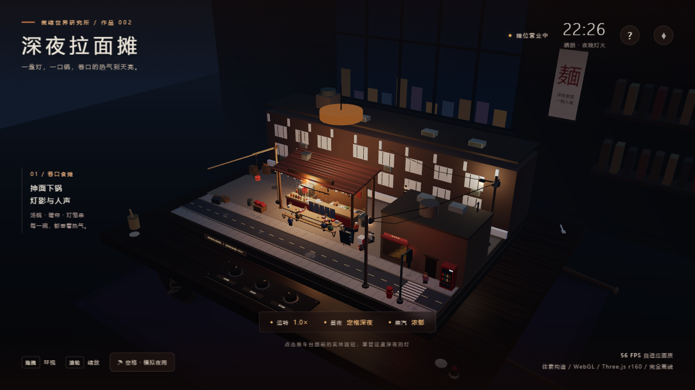
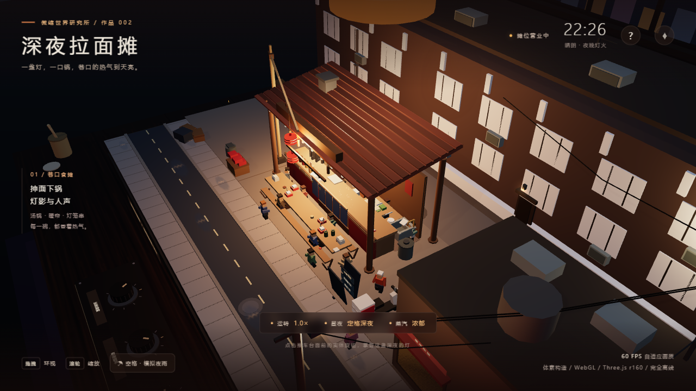
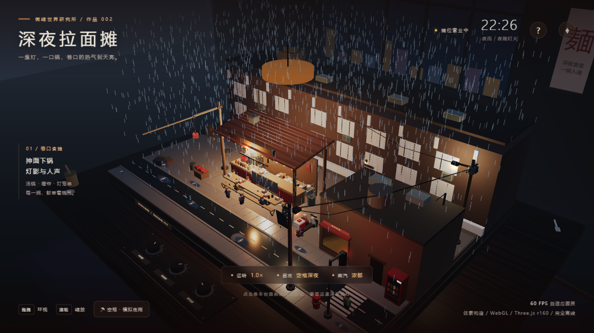
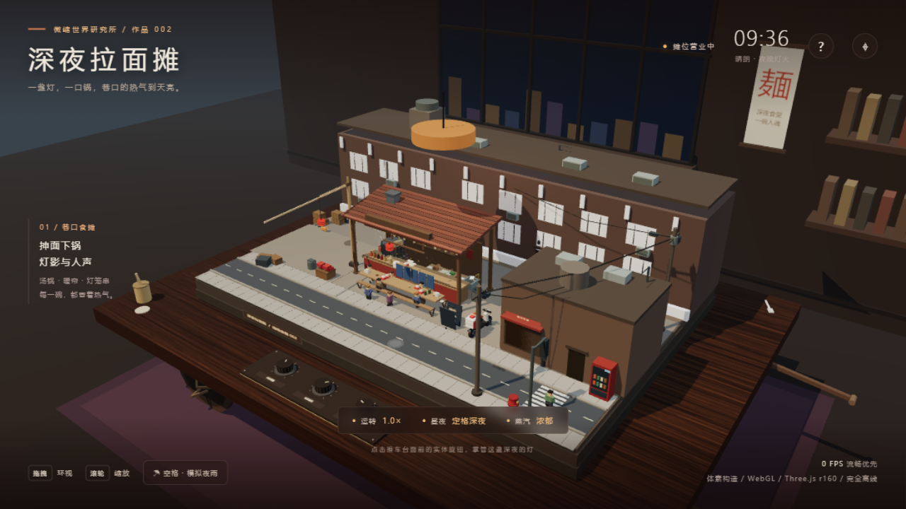

# 深夜拉面摊 · 体素微缩沙盘

摆放在室内旧木推车台面上的体素微缩深夜拉面摊：外卖摩托循环取餐配送、煮面篓起落、师傅抻面、竹竿吊臂挂灯笼、食客与流浪猫往来，配合四套天色与模拟夜雨。全部模型、纹理与粒子均由代码生成，Three.js r160 已内嵌，**断网可运行**。

> 在线演示：<https://fanhuayishiy.github.io/ai-demo/voxel-ramen-stall/preview.html>






## 主生成提示（原文）

> WebGL（Three.js r160，开发期可用 CDN，最终内嵌为单文件、断网可运行）创作一个体素微缩深夜拉面摊沙盘场景，输出为可直接在 Chrome 打开的单个 HTML 文件，不引用任何外部资源，全部几何体、材质、贴图使用代码生成，目标稳定 60FPS，杜绝物体穿模与越界。 场景载体：整套微缩深夜拉面摊摆放在室内旧木推车台面上，推车台面边角散落竹筷筒、酱油瓶、搪瓷碗、白瓷汤勺，第三人平视人眼高度视角观察整个沙盘。 拉面摊主体布局：完整深夜拉面摊，划分汤锅与煮面区、备料切配台、食客长凳与条桌、洗碗池与潲水桶、招牌灯箱与蓝布暖帘入口、后巷杂物角、路边人行道。 动态机械与摊位运转：多台体素设备与摊主持续作业，送面外卖摩托沿固定路线循环行驶，从摊位前取餐出发、穿过后巷驶向街口、在路口掉头折返、回到摊前熄火等单、接到新单再出发，循环往复；煮面篓在汤锅上原地往复起落，抓面下锅、沉入沸水、提起沥水、抖散装碗；拉面师傅在案板前持续抻面，取面团、双手抻拉、抖开、对折再抻、下锅、捞起、装碗递出；挂灯笼的长竹竿绕摊位横杆缓慢回转吊运，起吊新灯笼、平移对位、挂上横杆、空钩荡回；食客与流浪猫自由漫游，食客从街口走入、在菜单牌前驻足、落座长凳、吸面喝汤、起身离场，流浪猫沿桌脚与后巷慢悠悠游走、停下嗅闻、跳上啤酒箱打盹；汤锅上方排风扇持续旋转，暖帘随夜风摆动。 人物与细节：大量体素食客与摊主各司其职，有的拉面师傅在案板前抻面下锅、有的帮工在备料台切叉烧切葱花、有的食客坐在长凳上吸面喝汤、有的站着等位张望、有的举着手机拍照、有的收摊洗碗擦桌、外卖骑手在摊前取餐装箱；夜宵摊设置红灯笼串、蓝布暖帘、木招牌灯箱、塑料菜单牌、折叠长凳与条桌、啤酒箱、调料罐与酱油瓶醋瓶辣油、纸巾盒、一次性筷筒、潲水桶、煤气罐与软管、街边消防栓、路灯杆与架空电线、地面水洼与墙角烟头。 环境与昼夜系统：完整日夜循环，黎明薄雾、正午强光、黄昏逆光、夜晚灯火通明四套天色，默认停在深夜状态；夜晚汤锅上方吊灯、招牌灯箱、红灯笼串、后巷路灯、外卖摩托前照灯与摊位四周串灯、后巷住户窗户、街口信号灯向外发出暖黄与暖红辉光，照亮条桌与蒸腾的汤锅；汤锅蒸汽粒子缓缓上升飘散；按下空格键触发模拟夜雨，雨丝粒子斜落、地面与长凳湿滑反光、水洼泛起涟漪、灯光在湿地面拖出长条倒影，摊位照明亮度提升。 交互系统：鼠标拖拽环视相机，闲置时自动缓慢环绕场景；鼠标滚轮缩放视角，移动端支持双指缩放；鼠标点击推车台面前方实体控制旋钮：调节摊位运转速度与甩面煮面节奏、开关昼夜循环、切换汤锅蒸汽强度；按下空格键触发模拟夜雨，雨丝粒子斜落、地面湿滑反光，摊位灯光亮度提升。 技术要求：大量物体使用 InstancedMesh 实例化批渲染提升性能；自定义 shader 实现汤锅蒸汽粒子、灯光光晕与夜雨；所有运动物体做好碰撞约束与活动范围约束，不发生穿插穿模；全部拉面摊元素限定在沙盘推车台面范围之内，不会超出场景边界；静态体素按材质合并批渲染，重复食客与颗粒物实例化；全部随机数使用固定种子，每次打开画面完全一致；模拟时间与真实帧率解耦，低帧率下动作不变形；画质随帧率自适应；色彩丰富，体素方块颗粒质感明显，细节饱满。完成后请自查：所有运动物体在全时段模拟中与静态物及其他运动物体均无相交，且无元素越出沙盘边界。

## 功能亮点

**场景与布局**

- 室内旧木推车场景：辐条木轮、车把、台面边角散落竹筷筒、酱油瓶、搪瓷碗、白瓷汤勺，整套沙盘限定在推车台面范围之内
- 完整摊位分区：汤锅与煮面区（煤气罐与软管、吊灯、排风罩与旋转排风扇）、备料切配台、食客长凳与条桌、洗碗池与潲水桶、蓝布暖帘入口、木招牌灯箱、红灯笼横杆、塑料菜单牌
- 街景细节：后巷杂物角（啤酒箱、垃圾袋、墙角烟头）、路边人行道、消防栓、路灯杆与架空电线、街口信号灯、斑马线、地面水洼、后巷居民楼亮灯窗户与楼顶水箱

**动态机械与摊位运转**

- 外卖摩托沿固定路线循环：摊前取餐出发、穿过后巷、街口掉头折返、回摊熄火等单；骑手会下车走到柜台取餐装箱再出发
- 煮面篓在汤锅上往复起落：抓面下锅、沉入沸水、提起沥水、抖散装碗，与师傅节奏同步
- 拉面师傅持续抻面：取面团、双手抻拉、抖开、对折再抻、甩面下锅，装好的汤面沿柜台滑向出餐口
- 挂灯笼的长竹竿吊臂绕桅顶回转：起吊新灯笼、平移对位、挂上横杆，挂满五盏后再逐个取下替换，空钩荡回
- 食客从街口走入、在菜单牌前驻足、落座长凳吸面喝汤、起身离场；帮工切叉烧切葱花、洗碗、擦桌、等位张望、举手机拍照各司其职
- 流浪猫沿桌脚与后巷慢悠悠游走、停下嗅闻、两段式跳上啤酒箱打盹、跳下继续巡逻

**昼夜与天气系统**

- 完整日夜循环：黎明薄雾、正午强光、黄昏逆光、夜晚灯火通明四套天色，默认定格深夜
- 夜晚汤锅吊灯、招牌灯箱、红灯笼串、后巷路灯、摩托前照灯与摊位四周串灯、住户窗户、街口信号灯同时点亮，照亮条桌与蒸腾的汤锅
- 空格键触发模拟夜雨：雨丝斜落、水洼泛起涟漪、灯光在湿地面拖出长条倒影，摊位照明亮度提升
- 自定义 shader 实现汤锅蒸汽粒子、灯光光晕、夜雨丝、水洼涟漪与湿地面光带；暖帘通过顶点着色器注入随风摆动

**交互与性能**

- 鼠标拖拽环视、滚轮缩放（移动端双指缩放），闲置时相机自动缓慢环绕，右上角 ⌖ 重置视角
- 点击推车台面前方三个实体控制旋钮（或底部按钮）：调节摊位运转速度与甩面煮面节奏、开关昼夜循环、切换汤锅蒸汽强度
- 全部运动物体为纯 f(t) 确定性动画，模拟时间与真实帧率解耦，低帧率下动作不变形；固定随机种子，每次打开画面完全一致
- InstancedMesh 实例化批渲染（静态体素合并、人物零件与颗粒物实例化）+ 自适应画质调节，UI 显示实时 FPS

## 技术栈

| 依赖 | 版本 | 用途 |
| --- | --- | --- |
| Three.js | r160 | WebGL 渲染（已内嵌，离线运行） |
| 自定义 ShaderMaterial | — | 蒸汽粒子、雨丝、水洼涟漪、湿地面光带倒影、灯光光晕、暖帘摆动 |
| Node.js | 内置模块 | `build.cjs` 打包单文件 HTML，`audit-ramen.cjs` 全时段碰撞审计 |

## 运行方式

- 本地运行：直接双击 `preview.html` 在 Chrome 浏览器打开即可，无需联网、无需构建。
- 在线演示见顶部链接。

如需从源码重新打包单文件，或重跑一次碰撞审计：

```bash
node build.cjs
node audit-ramen.cjs
```

## 穿模与越界自查

`audit-ramen.cjs` 以 OBB + SAT 分离轴判据覆盖 480.3 秒全周期的 1921 个采样点，逐一体检测 240 个运动网格与 433 个静态障碍：

- **穿模 0 次、运动体互撞 0 次、越出沙盘边界 0 次**（见 `collision-report.json`，三个列表均为空）。
- 判据容差与体素贴合方式相同，曲面与细杆件以默认包围盒参与判定，不代表逐三角形精度。

## 目录结构

```
voxel-ramen-stall/
├── preview.html            # 最终单文件（HTML + CSS + JS，Three.js r160 内嵌）
├── shell.html              # 页面骨架（UI 覆盖层模板）
├── core.js                 # 渲染器、昼夜光照系统、体素批渲染基建
├── room.js                 # 室内木推车载体、台面边角道具、实体旋钮
├── street.js               # 静态沙盘：路面、摊位、后巷、街口、建筑
├── machines.js             # 动态实体：摩托/煮面篓/抻面师傅/吊臂/人物/猫
├── effects.js              # 蒸汽、夜雨、水洼、湿地面光带 shader
├── main.js                 # 相机、交互、UI、自适应画质、主循环与自查钩子
├── three-r160.min.js       # Three.js r160（UMD 内嵌源）
├── build.cjs               # 单文件打包脚本
├── audit-ramen.cjs         # 全时段 OBB 碰撞审计（1921 采样点）
├── collision-report.json   # 审计报告（零碰撞、零越界）
├── night-view.png          # 夜景全景
├── stall-closeup.png       # 摊位特写
├── rain-view.png           # 模拟夜雨
└── day-view.png            # 白天状态
```
