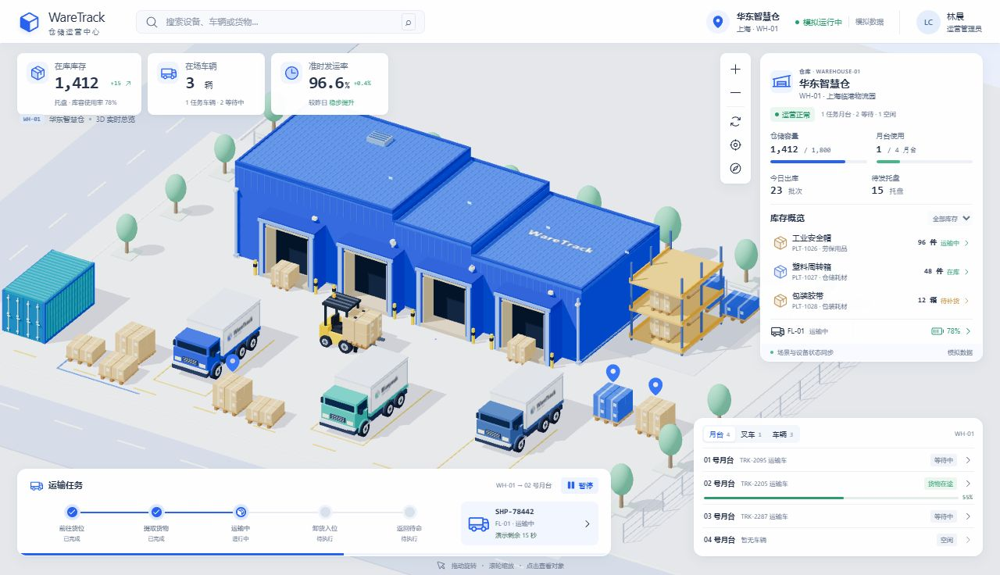
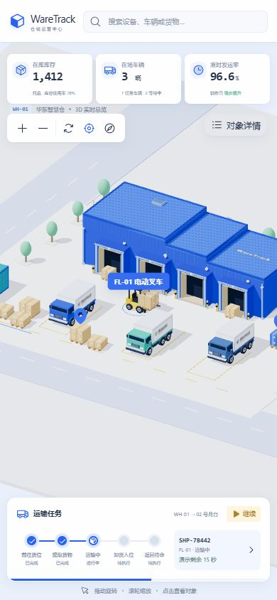

# WareTrack 仓储运营中心

一个可交互的单仓库三维运营看板：蓝色 WH-01、车辆与货物、确定性叉车搬运、中文业务面板。所有业务数据均为本地模拟数据，不连接真实 WMS。

[在线演示](https://fanhuayishiy.github.io/ai-demo/warehouse-demo/dist/client/) · [从零复现提示词](docs/RECREATE_PROMPT.zh-CN.md)

## 当前截图

桌面总览：



窄屏聚焦：



以上是当前项目截图，不是再次运行生成提示词所得的新项目。

## 功能与技术

- React 19、TypeScript、Vite 6、Three.js、React Three Fiber、Drei 与 Phosphor 图标；Vitest、Testing Library 提供自动化测试。
- 基础几何组合蓝墙、三段错层屋顶、突出门洞、波纹集装箱、货架、货垛、卡车和叉车；模型、图标与字体使用本地资源或系统字体。
- 8 个可选对象：1 座仓库、1 台叉车、3 辆卡车、3 组托盘。三维点击、搜索、库存筛选、设备列表和对象详情相互联动。
- 32 秒搬运闭环：前往货位、提取货物、运输、卸货、返回。叉车、货物、任务进度、02 号月台进度和演示倒计时共享模拟时钟。
- 拖动旋转、滚轮或按钮缩放、复位、对象聚焦；28 秒镜头巡游需主动开启，手动操作或选择对象会停止巡游。
- 900px 及以下隐藏月台列表、默认折叠详情；聚焦与开始巡游会收起详情，重复选择同一对象也能重新展开。
- 懒加载、场景异常提示、WebGL 上下文中断与恢复提示；减少动态效果偏好默认暂停搬运，用户仍可主动继续。

## 本地运行

使用 Node.js 22.12+，在本目录执行：

```sh
npm ci
npm run dev -- --host 127.0.0.1 --port 5183 --strictPort
```

安装 npm 依赖需要网络；安装、构建完成后，页面运行无需 CDN、在线模型或在线字体服务。用 HTTP 服务访问，不要直接双击 HTML。

```sh
npm test
npm run build
npm run test:sites
npm run test:pages # 在完整合集仓库中，构建后检查静态路径与末尾排序
npm run preview -- --host 127.0.0.1 --port 5184 --strictPort
```

开发地址为 `http://127.0.0.1:5183/`，生产预览地址为 `http://127.0.0.1:5184/`；需自行启动相应命令，本文不承诺服务当前正在运行。2026-10-07 在本发布目录重新安装与构建成功：17 个测试文件、104 项应用测试，4 项 Sites 测试及 3 项 Pages 发布检查全部通过。

## 操作说明

搜索支持名称、编号，方向键移动结果，Enter 选择、Escape 关闭；空白搜索不会误选隐藏结果。点击对象或库存条目查看详情；“聚焦选中对象”调整镜头，复位只恢复视角，不重置任务。

暂停/继续同时控制搬运及关联业务显示，不限制手动镜头或主动巡游。切到后台再回来不会补算隐藏期间的搬运时间。“演示剩余”是一轮 32 秒的剩余时间，不是真实发运 ETA。每轮结束托盘回到起点，不累加真实库存。

图形上下文中断时显示等待恢复提示并停止巡游，恢复后撤下提示。若初始化或渲染失败，搜索、详情与模拟控制仍可使用；可尝试刷新或检查浏览器硬件加速。

## 主生成提示（原文）

最早的完整创建请求不在当前可核验的续接记录里，因此这里不编造一段“最初生成提示”。当前可以逐字确认的续接请求是：

> 你再和之前视屏比对看看还差什么

> 继续直到全部做完

这两句是对既有项目的比对与继续完善要求，不是足以从零生成项目的完整规格。需要从零创建时，请使用 [RECREATE_PROMPT.zh-CN.md](docs/RECREATE_PROMPT.zh-CN.md)：它是此次根据成品源码、当前截图与已验证交互新整理的自包含提示词，不冒充历史原文，也未声称已用它再次生成完整项目。

## 目录与发布

```text
warehouse-demo/
├── src/
│   ├── App.tsx              # 共享时钟、选择状态、异常边界
│   ├── data.ts              # 8 对象目录
│   ├── simulation.ts        # 32 秒确定性状态采样
│   ├── scene/               # 几何模型、布局、镜头与资源管理
│   └── ui/                  # 中文面板与响应式样式
├── docs/
│   ├── RECREATE_PROMPT.zh-CN.md
│   └── screenshots/         # 当前项目截图
├── scripts/                 # 构建后的 Sites 包装准备
├── worker/                  # 可选 Sites 包装入口
├── tests/                   # Sites 包装测试；组件测试邻近源码
└── dist/client/             # 提交供 GitHub Pages 使用的静态产物
```

Vite 使用相对资源基址 `base: './'`，输出保持 `dist/client`，以支持 GitHub Pages 子目录 `/ai-demo/warehouse-demo/dist/client/`。更新源码后必须重新构建并同步提交 `dist/client`；仅改源码不会更新已提交的静态页面。

构建仍可生成 Sites 包装，但 Pages 只需静态客户端，不运行 Worker。`dist/server`、`dist/.openai` 不提交；源码中的 `.openai/hosting.json` 仅含空的 D1/R2 绑定声明，随源码保留以便干净克隆后复现构建，没有凭据。原始 MP4、参考视频截帧、会话记录与 `node_modules` 不包含在此发布目录中。

## 边界与许可

这是单 WH-01 前端演示，不含登录权限、数据库、后端接口、真实库存操作或多仓切换。路线预设，无物理碰撞、动态避障或自动调度；不保证与参考视频逐像素、原模型逐顶点一致。

重复盒体共享几何和同色材质，并处理卸载释放与 StrictMode 重挂载；并非全场景实例化，暂停也不意味着停止全部 WebGL 渲染。三维场景包仍较大，构建可能提示 chunk 体积警告。低端 GPU 性能及完整触控、多浏览器兼容矩阵未全面验证。

遵循仓库根目录的 [MIT License](../LICENSE)。第三方依赖仍遵循各自许可；Phosphor 图标许可见 [第三方声明](THIRD_PARTY_NOTICES.md)。
